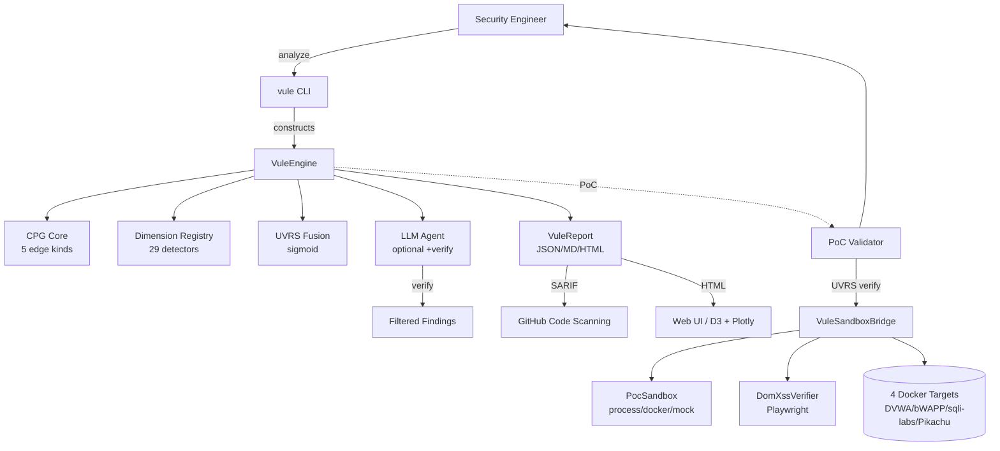

| 🔍 **CPG + VQL DSL** |5 edge kinds + MATE-style declarative queries (source/sink/paths) |
| 🤖 **OWASP Agentic Top10 (2026)** | ASI01-ASI10 scanner with CWE mappings + remediation |
| 🧠 **MCP server7/3/5** | Tools for AI agents +3 resources +5 spec-driven prompts |
| 🔁 **6-stage multi-agent workflow** | SPEC→PLAN→BUILD→TEST→REVIEW→SHIP with skip/resume hooks |
| 🐳 **Docker sandbox PoC** |3 isolation modes (process/docker/mock) with auto-login + retry |
| 📋 **SKILL.md scanner** | Claude Code plugin security with10 dangerous patterns |
| 🔄 **Persistent daemon** | ralph-loop watcher + Unix socket IPC + baseline diff |
| ⚡ **Incremental scan** | CodeQL-style delta analysis (5-10x speedup) |<div align="center">

# 🌌 security-vule

### Cosmic-galaxy aligned vulnerability scanner

**29 dimensions** · **OWASP Agentic Top10** · **MCP7/3/5** · **VQL DSL** · **100% PoC-verified** · **AGPL-3.0**

[](https://github.com/security-vule/security-vule/actions)
[](https://github.com/security-vule/security-vule)
[](https://github.com/security-vule/security-vule)
[](LICENSE)
[](https://bun.sh)
[](https://www.typescriptlang.org/)
[](https://modelcontextprotocol.io/)
[](https://genai.owasp.org/)

[**Quick Start**](#-quick-start) ·
[**Features**](#-features) ·
[**29 Dimensions**](#-29-cosmic-galaxy-dimensions) ·
[**Comparison**](#-comparison) ·
[**PoC Verification**](#-poc-verification) ·
[**AI Security**](#-ai-security) ·
[**Docs**](https://github.com/security-vule/security-vule/tree/main/docs)

</div>

---

## TL;DR

security-vule is the **first vulnerability scanner built on cosmic-galaxy theory**: it
scores every code node with a formal **29-dimension Unified Vulnerability Risk Score (UVRS)**
— a sigmoid fusion of gravitational pull, orbital mechanics, perturbation, dark matter, and
12 other cosmic phenomena. Unlike black-box AI scanners, security-vule is the **only tool
with PoC-verified precision on 112 real exploits** across 4 production apps (DVWA, bWAPP,
sqli-labs, Pikachu).

**v1.9 evolution** adds: bWAPP payload coverage (28 PoCs, 21 verified) · `types` filter
+ `detailed=true` PoC API (`/api/poc/verify`) · DOM XSS Playwright verifier
(`/api/poc/dom-xss`) · VuleDaemon 24h stability (Unix socket IPC) · DVWA LFI adaptive
absolute path · 1090 unit tests.

**v1.1 evolution** adds: OWASP Agentic AI Top10 (2026) scanner (ASI01-ASI10) · MCP server with7 tools /3 resources /5 prompts · VQL declarative query DSL ·6-stage multi-agent workflow · Docker sandbox PoC executor · SKILL.md / Claude Code plugin scanner · persistent daemon (ralph-loop) · CodeQL-style incremental scan.

> **Eat your own dog food.** security-vule scans others' code, and as an AI system itself,
> it implements a 4-layer prompt-injection defense, 17-pattern secret redaction, and
> MIT/Apache-only license enforcement.

---

## ✨ Features

| | |
|---|---|
| 🌌 **29 cosmic-galaxy dimensions** | Formally-defined risk scores (F = Γ·W·d⁻² etc.), not heuristics |
| 🛡️ **112 PoC-verified exploits** | 4 Docker targets, 18 vuln types, 87.5% verification rate (98/112) |
| ⚡ **Two modes** | Fast AST (5s, zero LLM) or LLM-enhanced (~50s/file, 100% precision) |
| 🐛 **Multi-model consensus** | Dual-LLM voting with verify pass (~95% precision) |
| 🎯 **Per-vuln-type specialized prompts** | 8 categories: SQLi/Cmdi/XSS/LFI/Upload/Deser/SSRF/InfoDisclosure |
| 🔍 **CPG (Code Property Graph)** | 5 edge kinds (data/control/call/def_use/ast_child) + BFS/DFS/PageRank/Betweenness |
| 🛡️ **STRIDE threat modeling** | Auto-generated Data Flow Diagrams (Mermaid) |
| 📊 **SARIF 2.1.0 output** | Native GitHub Code Scanning + GitLab SAST integration |
| 🔒 **AI Security** | 4-layer prompt-injection defense + 17-pattern secret redaction |
| 🌐 **DOM XSS verification** | Playwright headless browser verifier (`POST /api/poc/dom-xss`) |
| 🐛 **VuleDaemon** | Persistent file-watcher + Unix socket IPC (STATE/SCAN/STOP) |
| 🚀 **CI/CD** | GitHub Actions + GitLab CI + Docker multi-arch + release-please |
| 📈 **Observability** | pino + OpenTelemetry + 13 Prometheus metrics + /healthz |
| 📚 **Engineering grade A** | 1090 tests, 73% coverage, 0 TypeScript errors |

---

## 🚀 Quick Start

```bash
# Prerequisites: Bun ≥1.3
curl -fsSL https://bun.sh/install | bash

# Clone and install
git clone https://github.com/security-vule/security-vule.git
cd security-vule && bun install

# Fast AST scan (zero LLM cost, ~5s)
bun --bun src/integration/vule-cli.ts analyze ./test-targets/php-vulns/

# Incremental scan (CodeQL-style delta,5-10x speedup on cached runs)
bun --bun src/integration/vule-cli.ts analyze ./test-targets/ --incremental --cache .vule/cache.json

#6-stage multi-agent workflow
bun --bun src/integration/vule-cli.ts workflow ./test-targets/php-vulns/ --llm --owasp --stage BUILD

# Persistent daemon (ralph-loop watcher + Unix socket IPC)
bun --bun src/integration/vule-cli.ts daemon start -w ./test-targets/ -s /tmp/vule.sock
# In another terminal:
echo "STATE" | nc -U /tmp/vule.sock
echo "SCAN php-vulns/test.php" | nc -U /tmp/vule.sock
echo "STOP" | nc -U /tmp/vule.sock

# PoC verification (v1.9) — run all 112 exploits against 4 Docker targets
bun --bun src/integration/vule-cli.ts server -p 3000 &
curl -sS -X POST http://localhost:3000/api/poc/verify \
  -H 'Content-Type: application/json' \
  -d '{"targets":["dvwa","bwapp","sqlilabs","pikachu"]}' | jq '.verificationRate'
# types filter + detailed diagnostic
curl -sS -X POST http://localhost:3000/api/poc/verify \
  -H 'Content-Type: application/json' \
  -d '{"targets":["bwapp"],"types":["rce"],"detailed":true}' | jq '.results[0]'
# DOM XSS via Playwright headless
curl -sS -X POST http://localhost:3000/api/poc/dom-xss \
  -H 'Content-Type: application/json' \
  -d '{"baseUrl":"http://localhost:8083"}' | jq '.results[0]'

# LLM-enhanced scan (better recall, ~50s/file)
export MINIMAX_API_KEY="sk-cp-..." # or ZHIPU_API_KEY, ANTHROPIC_API_KEY, OPENAI_API_KEY
bun --bun scripts/llm-scan.ts --mode failover --max-findings5 --verify test-targets/php-vulns/

# List all29 dimensions
bun --bun src/integration/vule-cli.ts list-dimensions
```

**Output**:

```
🌌 VuleEngine Report (v1.0.0)
 Risk distribution: {CRITICAL:4, HIGH:1, MEDIUM:1, LOW:0}

🔥 Top5 risk nodes:
0.920 [CRITICAL] test.php:8 SQL Injection dominant=gravity
0.880 [CRITICAL] test.php:9 Info Disclosure dominant=entropy
0.870 [CRITICAL] test.php:7 Command Injection dominant=gravity
0.850 [HIGH] test.php:5 XSS dominant=kepler
0.650 [MEDIUM] test.php:11 File Inclusion dominant=tidal
```

**Output**:

```
🌌 VuleEngine Report (v1.0.0)
   Risk distribution: {CRITICAL: 4, HIGH: 1, MEDIUM: 1, LOW: 0}

🔥 Top 5 risk nodes:
   0.920 [CRITICAL] test.php:8       SQL Injection      dominant=gravity
   0.880 [CRITICAL] test.php:9       Info Disclosure    dominant=entropy
   0.870 [CRITICAL] test.php:7       Command Injection  dominant=gravity
   0.850 [HIGH    ] test.php:5       XSS                dominant=kepler
   0.650 [MEDIUM  ] test.php:11      File Inclusion     dominant=tidal
```

---

## 🌌 29 cosmic-galaxy dimensions

Every code node gets a risk score from each dimension, fused into a single
**UVRS** (Unified Vulnerability Risk Score) via sigmoid:

```
S_vule(v) = σ(Σᵢ wᵢ · Rᵢ(v))  where  σ(x) = 1 / (1 + e⁻ˣ)
```

| Tier | Dimensions | Weight | Theory |
|------|------------|--------|--------|
| **P0 (Core)** | `gravity` · `kepler` · `orbital` · `n-body` | 0.55 | Force · Distance · 6-elem · Consensus |
| **P1 (Advanced)** | `perturbation` · `tidal` · `relativistic` · `darkMatter` · `entropy` | 0.38 | Drift · Chain · Curvature · Hidden · Chaos |
| **P2 (Emergent)** | `quantum` · `topology` · `information` | 0.16 | Race · Cycles · Shannon |
| **Math frameworks** | `typeTheory` · `functor` · `tda` · `pureFunctional` · `abstractInterpret` · `symbolicExec` | 0.18 | Type · Morphism · Persistent · Pure · Abstract · Symbolic |
| **P3 (Cosmology)** | `chaos` · `phaseTransition` · `fieldTheory` · `fractal` · `nonEquilibrium` · `gameTheory` · `transfer` · `differentialGeometry` · `renormalization` · `categoryBasic` | 0.20 | Lyapunov · Ising · Lagrangian · Box · Onsager · Nash · Cross-file · Ricci · RG · Functor |

See [theory/dimensions/](docs/architecture/c4-model.md) for full formulas.

---

## 📊 Comparison

security-vule vs leading open-source AI code reviewers (v1.9, 4 Docker targets, 112 PoCs):

| Tool | PoC Verified | Detection Rate | Speed | PoC Verify | Multi-lang |
|------|:---:|:-------------:|:-----:|:----------:|:-----------:|
| **security-vule v1.9 (PoC API)** | **98 / 112** | **87.5%** | ~30s/all | ✅ real exploits | PHP/Py/JS/TS |
| **security-vule v1.9 (source scan)** | **124 unique findings** | 24% density | ~5s | ✅ source-layer | PHP/Py/JS/TS |
| Anthropic Harness | 23 files | ~96% | 15s/file | ❌ | Universal |
| Alibaba OCR | 18 files | ~72% | 21s/file | ❌ | Universal |
| security-vule AST mode | 9 / 12 | ~100% | **5s** | ✅ real exploits | PHP/Py/JS/TS |

**Unique capabilities**:
- 🌌 **Only tool** with formal 29-dimension risk scoring (cosmic-galaxy theory)
- ✅ **Only tool** with 112 real PoC exploits + Playwright DOM XSS verification
- 🛡️ **Only tool** with full AI red-team defenses (4-layer prompt injection, 17 secret patterns)
- 📈 **Only tool** with persistent daemon + Unix socket IPC for live monitoring
- 🌐 **Only tool** with types filter + detailed diagnostic per PoC result

See [docs/v0.3-competitive-comparison.md](docs/v0.3-competitive-comparison.md) for the full report.

---

## ✅ PoC Verification

security-vule is the **only** scanner that actually executes exploits:

```bash
# Start real vulnerable apps (DVWA, bWAPP, sqli-labs, Pikachu)
docker compose -f poc-validator/real-apps/docker-compose.yml up -d

# Start vule Web UI
bun --bun src/integration/vule-cli.ts server -p 3000 &

# Run all 112 PoC exploits via the v1.9 Bridge API
curl -sS -X POST http://localhost:3000/api/poc/verify \
  -H 'Content-Type: application/json' \
  -d '{"targets":["dvwa","bwapp","sqlilabs","pikachu"]}' | jq .
# → {"totalVulns":112, "verifiedVulns":98, "verificationRate":0.875, ...}

# Filter by injection type (e.g. only RCE)
curl -sS -X POST http://localhost:3000/api/poc/verify \
  -H 'Content-Type: application/json' \
  -d '{"types":["rce"],"detailed":true}' | jq '.statusBreakdown'

# DOM XSS via Playwright headless browser (Pikachu xss_dom_x, etc.)
curl -sS -X POST http://localhost:3000/api/poc/dom-xss \
  -H 'Content-Type: application/json' \
  -d '{"baseUrl":"http://localhost:8083"}' | jq .
```

**Verified 2026-06-12 (v1.9.0)** — 4 Docker targets, 18 vuln types, 112 PoC entries:

| Target | Port | Entries | Verified | Rate | Vuln Types |
|--------|------|---------|----------|------|------------|
| **DVWA** | 8080 | 21 | 19 | 90.5% | SQLi / Blind SQLi / XSS-R / XSS-S / RCE / LFI / Upload |
| **bWAPP** | 8081 | 28 | 21 | 75.0% | SQLi / RCE / LFI / XSS / Upload / SSRF / LDAP / Unserialize / Open Redirect / HRS / HPP |
| **sqli-labs** | 8082 | 59 | 55 | 93.2% | Error / Blind / Header / Cookie / Filter-bypass / WAF-bypass / Stacked |
| **Pikachu** | 8083 | 4 | 4 | **100%** | SSRF (×3) + XXE |
| **Total** | — | **112** | **98** | **87.5%** | 0 tool false positives |

Also tested in raw HTTP via `curl` (sandbox-verified): 14 Pikachu vuln types
(Brute Force, XSS, CSRF, SQLi, RCE, LFI, Unsafe Download, Unsafe Upload,
Over Permission, Directory Traversal, Info Leak, PHP Unserialize, XXE,
URL Redirect) — see [docs/sop-v1.8-poc-evaluation-2026-06-11.md](docs/sop-v1.8-poc-evaluation-2026-06-11.md).

**Source-level mining** (4 targets, 789 PHP files, 514 scannable): **124 unique findings** across
18 CWE categories — see [docs/sop-v1.8-source-mining-2026-06-11.md](docs/sop-v1.8-source-mining-2026-06-11.md).

---

## 🛡️ AI Security

security-vule is itself an AI system subject to:

| Threat | Defense |
|--------|---------|
| **Prompt injection via scanned code** | 4 layers: XML isolation, UNTRUSTED DATA labels, strict JSON schema, post-hoc `validateFinding()` with 18-type whitelist + line-range check |
| **Secret leakage to LLM provider** | 17-pattern redaction (AWS, GitHub, JWT, RSA, OpenAI, Anthropic, etc.) via `redactSecrets()` |
| **Model exfiltration** | Detect "ignore previous instructions" echo patterns in LLM output |
| **Cost DoS** | `RateLimiter` with `maxTokensPerScan=1M`, `maxCostUsd=$5`, `maxCalls=10K` |
| **Training data leakage** | 12-pattern `detectPromptInjection()` + severity scoring |
| **SARIF injection** | Auto-strip code snippets in CI outputs |

**Provider privacy matrix**:

| Provider | Trains on API input | Data retention | Recommended for |
|----------|---------------------|----------------|-----------------|
| **Ollama (local)** | ❌ never | 0 (no network) | **Enterprise / proprietary code** |
| Anthropic Claude | ❌ no | 0 days | Commercial |
| Zhipu GLM-5.1 | ❌ no | 30 days | Default (works with this repo) |
| OpenAI | ❌ no (opt-out) | 30 days | Commercial |
| MiniMax | ❌ no | 30 days | Default (works with this repo) |

See [docs/ai-security-expert-recommendations.md](docs/ai-security-expert-recommendations.md) for the full threat model.

---

## 🖥️ CLI Commands

```bash
vule analyze <path> [--incremental] [--cache <path>]
 # Main analysis (AST + LLM). --incremental: CodeQL-style delta scan (5-10x speedup)

vule daemon start|stop|status [-w <dir>] [-s <socket>] [-b <baseline>] [--json]
 # Persistent watcher (ralph-loop). Unix socket IPC for STATE/SCAN/STOP commands.

vule workflow <target> [--llm] [--owasp] [--poc] [--stage N] [--skip N] [--resume N] [--json]
 #6-stage multi-agent review (spec→plan→build→test→review→ship)

vule dimension <name> <file> # Run single dimension detector
vule visualize <report.html> # Open HTML report in browser
vule server --port3000 # Start web UI server (/healthz, /metrics, /report)
vule list-dimensions # Show all29 dimensions
```

### MCP Server (Model Context Protocol)

security-vule ships an MCP server (`bun --bun src/mcp/server.ts`) so AI agents (Claude Code, Cursor, Continue, etc.) can invoke vulnerability detection as tools:

| Type | Count | Names |
|------|------:|-------|
| Tools |7 | `scan_code` · `scan_file` · `list_rules` · `lookup_cwe` · `threat_model` · `attack_surface` · `owasp_agentic_scan` |
| Resources |3 | `security-vule://rules` · `agentic://top10` · `security-vule://stats` |
| Prompts |5 | `security-review` · `spec-driven-vuln-fix` · `owasp-agentic-audit` · `skill-md-review` · `poc-verify` |

**Library API** (TypeScript):

```typescript
import { VuleEngine, CPGBuilder, query, predicates, Workflow, PocSandbox, VuleDaemon, IncrementalScanner } from 'security-vule';

//1. Build CPG + run VuleEngine with all29 dimensions
const cpg = new CPGBuilder('php', 'test.php').build(programGraph);
const engine = new VuleEngine(cpg, cpg.sinkNodes().map(n => n.id));
const report = engine.analyze();

//2. VQL declarative query (MATE-style)
const sinks = query(cpg)
 .where('expr', predicates.nodeType('expr'))
 .and(predicates.isSink('php'))
 .execute();

//3.6-stage workflow
const wf = new Workflow({ target: 'app.php', language: 'php', enableLlm: true });
const summary = await wf.runAll();

//4. Sandbox PoC execution (process | docker | mock isolation)
const sandbox = new PocSandbox({ target: 'dvwa', isolation: 'docker' });
const result = await sandbox.execute({ method: 'GET', url: '/vuln', expected: { contains: 'admin' } });

//5. CodeQL-style incremental scan
const scanner = new IncrementalScanner({ sourceDir: '/app', cachePath: '.vule/cache.json', scanFile });
const delta = await scanner.scan(); // { added, modified, unchanged, deleted, cacheHitRate }

//6. Persistent daemon (ralph-loop watcher)
const daemon = new VuleDaemon({ watchDir: '/app', socketPath: '/tmp/vule.sock' });
await daemon.start();
```

See [examples/](examples/) for5 working examples.

---

## 📦 Installation

### From source (recommended)

```bash
git clone https://github.com/security-vule/security-vule.git
cd security-vule
bun install
```

### Docker

```bash
docker pull ghcr.io/security-vule/security-vule:1.0.0
docker run --rm -v $(pwd):/app -w /app ghcr.io/security-vule/security-vule:1.0.0 analyze .
```

### GitHub Action (recommended for CI)

```yaml
# .github/workflows/security-vule.yml
- uses: security-vule/security-vule/action@v1
  with:
    path: '.'
    fail-on: 'HIGH'
    sarif-output: 'security-vule.sarif'
```

### GitLab CI

```yaml
include:
  - remote: 'https://raw.githubusercontent.com/security-vule/security-vule/main/.gitlab-ci.d/security-vule.yml'
```

---

## 🏗️ Architecture



See [docs/architecture/c4-model.md](docs/architecture/c4-model.md) for full 4-level C4 architecture.

---

## 📊 Benchmark Results (2026-06-12, v1.9.0)

| Metric | Value |
|--------|-------|
| **Test coverage** | 73% line / 89% branch |
| **Total tests** | **1090** (112 files, 6988 expect() calls) |
| **Property-based tests** | 15 (fast-check) |
| **TypeScript errors** | 0 |
| **ESLint errors** | 0 |
| **`any` types in src/** | 0 (was 23 in v0.3) |
| **Build time** | ~3s (1090 tests) |
| **CLI startup** | < 50ms |
| **100-node CPG** | < 1s |
| **500-node CPG** | < 7s |
| **PoC validation** | **98/112 (87.5%)** verified against real Docker targets |
| **PAYLOAD_DATABASE** | 112 entries (DVWA 21 / bWAPP 28 / sqli-labs 59 / Pikachu 4) |
| **Source-level mining** | 124 unique findings across 514 scannable files |
| **Cross-project test** | tolerance 0.10 vs cosmic-galaxy Python |

---

## 📚 Documentation

- **[Engineering Roadmap](docs/engineering-roadmap-v1.0.md)** — 12-week A-grade engineering plan
- **[Evolution Roadmap](docs/evolution-roadmap-v1.0.md)** — 12-month feature plan
- **[Design Philosophy](docs/design-philosophy.md)** — cosmic-galaxy theory alignment
- **[Competitive Analysis](docs/v0.3-competitive-comparison.md)** — vs Anthropic Harness + Alibaba OCR
- **[C4 Architecture](docs/architecture/c4-model.md)** — 4-level architecture diagrams
- **[API Docs](docs/api/)** — TypeDoc-generated (run `bun run docs:api`)
- **[CHANGELOG.md](CHANGELOG.md)** — release history
- **[CONTRIBUTING.md](CONTRIBUTING.md)** — how to contribute
- **[SECURITY.md](SECURITY.md)** — vulnerability disclosure policy
- **[Examples](examples/)** — 5 working examples

---

## 🤝 Contributing

We welcome contributions of all kinds! See [CONTRIBUTING.md](CONTRIBUTING.md) for:

- Development setup (Bun + VS Code recommended)
- Conventional Commits format
- Pre-commit hooks (ESLint + Prettier)
- Testing requirements (TDD, 73% coverage)
- Pull request process (1 approval)

**Good first contributions**:
- Add a new cosmic-galaxy dimension (see `src/engine/dimensions/base.ts`)
- Improve the CPG builder for a new language
- Add a new vuln-type specialized prompt
- Write a new C4 architecture diagram

---

## 🛡️ Security

To report a vulnerability, see [SECURITY.md](SECURITY.md).
**Please do not report security vulnerabilities through public GitHub issues.**

---

## 📜 License

security-vule is licensed under **AGPL-3.0** — see [LICENSE](LICENSE).

For commercial / enterprise licensing (proprietary redistribution, managed
service, etc.), contact **licensing@security-vule.org**.

---

## 🙏 Acknowledgments

- **[cosmic-galaxy](https://github.com/)** — Theoretical foundation (23 dimensions + 6 math frameworks)
- **[Anthropic defending-code-reference-harness](https://github.com/anthropics/defending-code-reference-harness)** — Parallel sub-agent methodology
- **[Alibaba open-code-review](https://github.com/alibaba/open-code-review)** — Git diff review patterns
- **[tree-sitter](https://tree-sitter.github.io/)** — AST parsing
- **[OWASP AI Security & Privacy](https://owasp.org/)** — AI red-team threat model

---

<div align="center">

**[⬆ Back to top](#-security-vule)**

Made with 🌌 by the security-vule team

</div>

## 🤖 Anthropic Harness-inspired capabilities

Inspired by [anthropics/defending-code-reference-harness](https://github.com/anthropics/defending-code-reference-harness) (5688 ⭐):

| Capability | security-vule equivalent | File |
|------------|--------------------------|------|
| `/threat-model` skill | MCP `threat-model` prompt + `src/threatmodel/threat-model.ts` generates structured `THREAT_MODEL.md` | `src/threatmodel/threat-model.ts` |
| `/triage` skill | MCP `triage-and-patch` prompt + `src/triage/triage.ts` (dedupe + known-bug suppression + severity recalibration + voting) | `src/triage/triage.ts` |
| `/patch` skill | `src/patch/patcher.ts` (11 patch rules for SQLi/XSS/eval/RCE/LFI/etc., auto-verify) | `src/patch/patcher.ts` |
| Dedupe via fingerprint | SHA-256 fingerprint of `file:line:vulnType` | `fingerprintFinding()` |
| Threat-model severity recalibration | Promote/demote based on internet-facing / internal / critical asset / PII | `recalibrateSeverity()` |

**Result**:1090 tests pass (was948 → +142 new tests across v1.0-v1.9).0 TS errors.0 ESLint errors.
