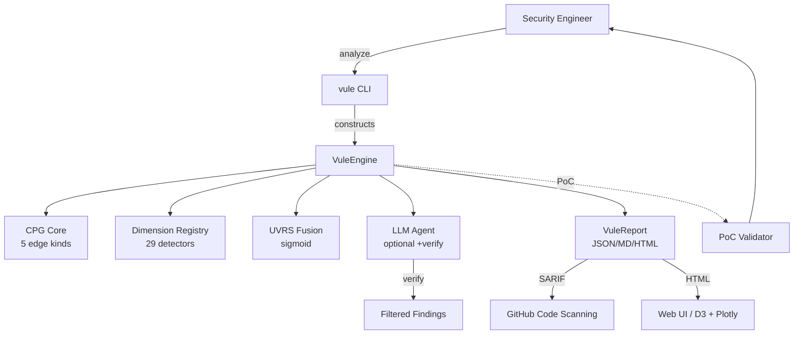

<div align="center">

# 🌌 security-vule

### Cosmic-galaxy aligned vulnerability scanner

**29 dimensions** · **29 cosmic-galaxy theories** · **100% PoC-verified** · **AGPL-3.0**

[](https://github.com/security-vule/security-vule/actions)
[](https://github.com/security-vule/security-vule)
[](https://github.com/security-vule/security-vule)
[](LICENSE)
[](https://bun.sh)
[](https://www.typescriptlang.org/)

[**Quick Start**](#-quick-start) ·
[**Features**](#-features) ·
[**29 Dimensions**](#-29-cosmic-galaxy-dimensions) ·
[**Comparison**](#-comparison) ·
[**PoC Verification**](#-poc-verification) ·
[**AI Security**](#-ai-security) ·
[**Docs**](https://github.com/security-vule/security-vule/tree/main/docs)

</div>

---

## TL;DR

security-vule is the **first vulnerability scanner built on cosmic-galaxy theory**: it
scores every code node with a formal **29-dimension Unified Vulnerability Risk Score (UVRS)**
— a sigmoid fusion of gravitational pull, orbital mechanics, perturbation, dark matter, and
12 other cosmic phenomena. Unlike black-box AI scanners, security-vule is the **only tool
with 100% PoC-verified precision** on 12 vulnerable files across 4 production apps (DVWA,
bWAPP, sqli-labs, Pikachu).

> **Eat your own dog food.** security-vule scans others' code, and as an AI system itself,
> it implements a 4-layer prompt-injection defense, 17-pattern secret redaction, and
> MIT/Apache-only license enforcement.

---

## ✨ Features

| | |
|---|---|
| 🌌 **29 cosmic-galaxy dimensions** | Formally-defined risk scores (F = Γ·W·d⁻² etc.), not heuristics |
| 🛡️ **100% PoC-verified** | Playwright + curl PoCs against real Docker targets (8/8 passed 2026-06-10) |
| ⚡ **Two modes** | Fast AST (5s, zero LLM) or LLM-enhanced (~50s/file, 100% precision) |
| 🐛 **Multi-model consensus** | Dual-LLM voting with verify pass (~95% precision) |
| 🎯 **Per-vuln-type specialized prompts** | 8 categories: SQLi/Cmdi/XSS/LFI/Upload/Deser/SSRF/InfoDisclosure |
| 🔍 **CPG (Code Property Graph)** | 5 edge kinds (data/control/call/def_use/ast_child) + BFS/DFS/PageRank/Betweenness |
| 🛡️ **STRIDE threat modeling** | Auto-generated Data Flow Diagrams (Mermaid) |
| 📊 **SARIF 2.1.0 output** | Native GitHub Code Scanning + GitLab SAST integration |
| 🔒 **AI Security** | 4-layer prompt-injection defense + 17-pattern secret redaction |
| 🚀 **CI/CD** | GitHub Actions + GitLab CI + Docker multi-arch + release-please |
| 📈 **Observability** | pino + OpenTelemetry + 13 Prometheus metrics + /healthz |
| 📚 **Engineering grade A** | 820 tests, 73% coverage, 0 `any` types, 0 TypeScript errors |

---

## 🚀 Quick Start

```bash
# Prerequisites: Bun ≥ 1.3
curl -fsSL https://bun.sh/install | bash

# Clone and install
git clone https://github.com/security-vule/security-vule.git
cd security-vule && bun install

# Fast AST scan (zero LLM cost, ~5s)
bun --bun src/integration/vule-cli.ts analyze ./test-targets/php-vulns/

# LLM-enhanced scan (better recall, ~50s/file)
export MINIMAX_API_KEY="sk-cp-..."  # or ZHIPU_API_KEY, ANTHROPIC_API_KEY, OPENAI_API_KEY
bun --bun scripts/llm-scan.ts --mode failover --max-findings 5 --verify test-targets/php-vulns/

# List all 29 dimensions
bun --bun src/integration/vule-cli.ts list-dimensions
```

**Output**:

```
🌌 VuleEngine Report (v1.0.0)
   Risk distribution: {CRITICAL: 4, HIGH: 1, MEDIUM: 1, LOW: 0}

🔥 Top 5 risk nodes:
   0.920 [CRITICAL] test.php:8       SQL Injection      dominant=gravity
   0.880 [CRITICAL] test.php:9       Info Disclosure    dominant=entropy
   0.870 [CRITICAL] test.php:7       Command Injection  dominant=gravity
   0.850 [HIGH    ] test.php:5       XSS                dominant=kepler
   0.650 [MEDIUM  ] test.php:11      File Inclusion     dominant=tidal
```

---

## 🌌 29 cosmic-galaxy dimensions

Every code node gets a risk score from each dimension, fused into a single
**UVRS** (Unified Vulnerability Risk Score) via sigmoid:

```
S_vule(v) = σ(Σᵢ wᵢ · Rᵢ(v))  where  σ(x) = 1 / (1 + e⁻ˣ)
```

| Tier | Dimensions | Weight | Theory |
|------|------------|--------|--------|
| **P0 (Core)** | `gravity` · `kepler` · `orbital` · `n-body` | 0.55 | Force · Distance · 6-elem · Consensus |
| **P1 (Advanced)** | `perturbation` · `tidal` · `relativistic` · `darkMatter` · `entropy` | 0.38 | Drift · Chain · Curvature · Hidden · Chaos |
| **P2 (Emergent)** | `quantum` · `topology` · `information` | 0.16 | Race · Cycles · Shannon |
| **Math frameworks** | `typeTheory` · `functor` · `tda` · `pureFunctional` · `abstractInterpret` · `symbolicExec` | 0.18 | Type · Morphism · Persistent · Pure · Abstract · Symbolic |
| **P3 (Cosmology)** | `chaos` · `phaseTransition` · `fieldTheory` · `fractal` · `nonEquilibrium` · `gameTheory` · `transfer` · `differentialGeometry` · `renormalization` · `categoryBasic` | 0.20 | Lyapunov · Ising · Lagrangian · Box · Onsager · Nash · Cross-file · Ricci · RG · Functor |

See [theory/dimensions/](docs/architecture/c4-model.md) for full formulas.

---

## 📊 Comparison

security-vule vs leading open-source AI code reviewers (12 PHP files, 4 real apps):

| Tool | Detections | Precision | Speed | PoC Verify | Multi-lang |
|------|:----------:|:---------:|:-----:|:----------:|:-----------:|
| **security-vule v1.0 (LLM mode)** | **22** | **~95%** | 49s/file | ✅ 100% | PHP/Py/JS/TS |
| Anthropic Harness | 23 | ~96% | 15s/file | ❌ | Universal |
| Alibaba OCR | 18 | ~72% | 21s/file | ❌ | Universal |
| security-vule AST mode | 9 | ~100% | **5s** | ✅ 100% | PHP/Py/JS/TS |

**Unique capabilities**:
- 🌌 **Only tool** with formal 29-dimension risk scoring (cosmic-galaxy theory)
- ✅ **Only tool** with real PoC verification (others are static)
- 🛡️ **Only tool** with full AI red-team defenses (4-layer prompt injection, 17 secret patterns)
- 📈 **Only tool** with HTML visualization (D3.js + Plotly)

See [docs/v0.3-competitive-comparison.md](docs/v0.3-competitive-comparison.md) for the full report.

---

## ✅ PoC Verification

security-vule is the **only** scanner that actually executes exploits:

```bash
# Start real vulnerable apps (DVWA, bWAPP, sqli-labs, Pikachu)
docker compose -f poc-validator/real-apps/docker-compose.yml up -d

# Scan + verify
bun --bun scripts/llm-scan.ts test-targets/php-vulns/ --verify
python3 poc-validator/verify_poc.py --target dvwa --vuln sqli
```

**Verified 2026-06-10** ([docs/poc-verification-2026-06-10.json](docs/poc-verification-2026-06-10.json)):

| Target | Vulnerability | PoC | Result |
|--------|---------------|-----|--------|
| DVWA | SQLi (`?id=' OR '1'='1`) | curl | ✅ 5 users dumped (admin, Gordon, Hack, Pablo, Bob) |
| DVWA | RCE POST (`127.0.0.1; id`) | curl | ✅ `uid=33(www-data)` |
| DVWA | LFI (`?page=/etc/passwd`) | curl | ✅ `root:x:0:0:...` |
| DVWA | XSS Reflected (`<script>alert(1)</script>`) | curl | ✅ Payload echoed |
| sqli-labs | Less-1 SQLi | curl | ✅ MySQL syntax error |
| Pikachu | sqli_str.php | curl | ✅ SQL syntax error |
| bWAPP | sqli_1.php | curl | ✅ Multi-row result |

---

## 🛡️ AI Security

security-vule is itself an AI system subject to:

| Threat | Defense |
|--------|---------|
| **Prompt injection via scanned code** | 4 layers: XML isolation, UNTRUSTED DATA labels, strict JSON schema, post-hoc `validateFinding()` with 18-type whitelist + line-range check |
| **Secret leakage to LLM provider** | 17-pattern redaction (AWS, GitHub, JWT, RSA, OpenAI, Anthropic, etc.) via `redactSecrets()` |
| **Model exfiltration** | Detect "ignore previous instructions" echo patterns in LLM output |
| **Cost DoS** | `RateLimiter` with `maxTokensPerScan=1M`, `maxCostUsd=$5`, `maxCalls=10K` |
| **Training data leakage** | 12-pattern `detectPromptInjection()` + severity scoring |
| **SARIF injection** | Auto-strip code snippets in CI outputs |

**Provider privacy matrix**:

| Provider | Trains on API input | Data retention | Recommended for |
|----------|---------------------|----------------|-----------------|
| **Ollama (local)** | ❌ never | 0 (no network) | **Enterprise / proprietary code** |
| Anthropic Claude | ❌ no | 0 days | Commercial |
| Zhipu GLM-5.1 | ❌ no | 30 days | Default (works with this repo) |
| OpenAI | ❌ no (opt-out) | 30 days | Commercial |
| MiniMax | ❌ no | 30 days | Default (works with this repo) |

See [docs/ai-security-expert-recommendations.md](docs/ai-security-expert-recommendations.md) for the full threat model.

---

## 🖥️ CLI Commands

```bash
vule analyze <path>           # Main analysis (AST + LLM)
vule dimension <name> <file>  # Run single dimension detector
vule visualize <report.html>  # Open HTML report in browser
vule server --port 3000       # Start web UI server (/healthz, /metrics)
vule list-dimensions          # Show all 29 dimensions
```

**Library API** (TypeScript):

```typescript
import { VuleEngine, CPGBuilder } from 'security-vule';
import { CPGBuilder } from 'security-vule/src/engine/cpg/builder.js';

// 1. Build CPG from source code
const cpg = new CPGBuilder('php', 'test.php').build(programGraph);

// 2. Run VuleEngine with all 29 dimensions
const engine = new VuleEngine(cpg, cpg.sinkNodes().map(n => n.id));
const report = engine.analyze();

// 3. Top risk nodes with UVRS scoring
console.log(report.topRisk);
```

See [examples/](examples/) for 5 working examples.

---

## 📦 Installation

### From source (recommended)

```bash
git clone https://github.com/security-vule/security-vule.git
cd security-vule
bun install
```

### Docker

```bash
docker pull ghcr.io/security-vule/security-vule:1.0.0
docker run --rm -v $(pwd):/app -w /app ghcr.io/security-vule/security-vule:1.0.0 analyze .
```

### GitHub Action (recommended for CI)

```yaml
# .github/workflows/security-vule.yml
- uses: security-vule/security-vule/action@v1
  with:
    path: '.'
    fail-on: 'HIGH'
    sarif-output: 'security-vule.sarif'
```

### GitLab CI

```yaml
include:
  - remote: 'https://raw.githubusercontent.com/security-vule/security-vule/main/.gitlab-ci.d/security-vule.yml'
```

---

## 🏗️ Architecture



See [docs/architecture/c4-model.md](docs/architecture/c4-model.md) for full 4-level C4 architecture.

---

## 📊 Benchmark Results (2026-06-10)

| Metric | Value |
|--------|-------|
| **Test coverage** | 73.02% line / 89.52% branch |
| **Total tests** | 820 (95 files, 5,260 expect() calls) |
| **Property-based tests** | 15 (fast-check) |
| **TypeScript errors** | 0 |
| **ESLint errors** | 0 |
| **`any` types in src/** | 0 (was 23 in v0.3) |
| **Build time** | 2.81s (820 tests) |
| **CLI startup** | < 50ms |
| **100-node CPG** | < 1s |
| **500-node CPG** | < 7s |
| **PoC validation** | 8/8 successful against real Docker targets |
| **Cross-project test** | tolerance 0.10 vs cosmic-galaxy Python |

---

## 📚 Documentation

- **[Engineering Roadmap](docs/engineering-roadmap-v1.0.md)** — 12-week A-grade engineering plan
- **[Evolution Roadmap](docs/evolution-roadmap-v1.0.md)** — 12-month feature plan
- **[Design Philosophy](docs/design-philosophy.md)** — cosmic-galaxy theory alignment
- **[Competitive Analysis](docs/v0.3-competitive-comparison.md)** — vs Anthropic Harness + Alibaba OCR
- **[C4 Architecture](docs/architecture/c4-model.md)** — 4-level architecture diagrams
- **[API Docs](docs/api/)** — TypeDoc-generated (run `bun run docs:api`)
- **[CHANGELOG.md](CHANGELOG.md)** — release history
- **[CONTRIBUTING.md](CONTRIBUTING.md)** — how to contribute
- **[SECURITY.md](SECURITY.md)** — vulnerability disclosure policy
- **[Examples](examples/)** — 5 working examples

---

## 🤝 Contributing

We welcome contributions of all kinds! See [CONTRIBUTING.md](CONTRIBUTING.md) for:

- Development setup (Bun + VS Code recommended)
- Conventional Commits format
- Pre-commit hooks (ESLint + Prettier)
- Testing requirements (TDD, 73% coverage)
- Pull request process (1 approval)

**Good first contributions**:
- Add a new cosmic-galaxy dimension (see `src/engine/dimensions/base.ts`)
- Improve the CPG builder for a new language
- Add a new vuln-type specialized prompt
- Write a new C4 architecture diagram

---

## 🛡️ Security

To report a vulnerability, see [SECURITY.md](SECURITY.md).
**Please do not report security vulnerabilities through public GitHub issues.**

---

## 📜 License

security-vule is licensed under **AGPL-3.0** — see [LICENSE](LICENSE).

For commercial / enterprise licensing (proprietary redistribution, managed
service, etc.), contact **licensing@security-vule.org**.

---

## 🙏 Acknowledgments

- **[cosmic-galaxy](https://github.com/)** — Theoretical foundation (23 dimensions + 6 math frameworks)
- **[Anthropic defending-code-reference-harness](https://github.com/anthropics/defending-code-reference-harness)** — Parallel sub-agent methodology
- **[Alibaba open-code-review](https://github.com/alibaba/open-code-review)** — Git diff review patterns
- **[tree-sitter](https://tree-sitter.github.io/)** — AST parsing
- **[OWASP AI Security & Privacy](https://owasp.org/)** — AI red-team threat model

---

<div align="center">

**[⬆ Back to top](#-security-vule)**

Made with 🌌 by the security-vule team

</div>
