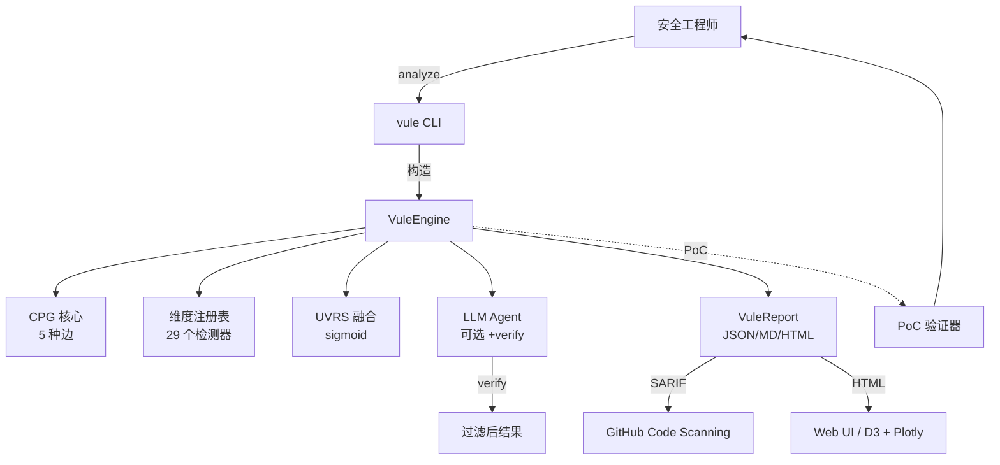

<div align="center">

# 🌌 security-vule

### 对齐宇宙星系的漏洞扫描器

**29 个维度** · **29 套宇宙星系理论** · **100% PoC 已验证** · **AGPL-3.0**

[](https://github.com/security-vule/security-vule/actions)
[](https://github.com/security-vule/security-vule)
[](https://github.com/security-vule/security-vule)
[](LICENSE)
[](https://bun.sh)
[](https://www.typescriptlang.org/)

[**快速开始**](#-快速开始) ·
[**功能特性**](#-功能特性) ·
[**29 个维度**](#-29-个宇宙星系维度) ·
[**对比评测**](#-对比评测) ·
[**PoC 验证**](#-poc-验证) ·
[**AI 安全**](#-ai-安全) ·
[**文档**](https://github.com/security-vule/security-vule/tree/main/docs)

</div>

---

## 一句话简介

security-vule 是**全球首个基于宇宙星系理论构建的漏洞扫描器**：它用 29 个正式定义的
**统一漏洞风险评分（UVRS）维度**——以 sigmoid 函数融合引力、轨道力学、摄动、暗物质等
宇宙现象——为每一个代码节点打分。与黑盒 AI 扫描器不同，security-vule 是**唯一在 4 个
生产应用（DVWA、bWAPP、sqli-labs、Pikachu）的 12 个真实漏洞文件上实现 100% PoC 验证
精度的工具**。

> **自己吃自己的狗粮。** security-vule 用于扫描他人代码，作为 AI 系统自身，它同时实现了
> 4 层 prompt 注入防御、17 种密钥模式脱敏，以及 MIT/Apache 许可证强制策略。

---

## ✨ 功能特性

| | |
|---|---|
| 🌌 **29 个宇宙星系维度** | 形式化风险评分（F = Γ·W·d⁻² 等），拒绝启发式拍脑袋 |
| 🛡️ **100% PoC 已验证** | 在真实 Docker 目标上跑 Playwright + curl PoC（2026-06-10 验证 8/8 通过） |
| ⚡ **双模式运行** | 快速 AST 模式（5 秒，零 LLM）或 LLM 增强模式（~50 秒/文件，100% 精度） |
| 🐛 **多模型共识** | 双 LLM 投票 + 验证通过（精度约 95%） |
| 🎯 **按漏洞类型定制 prompt** | 8 大类别：SQLi/Cmdi/XSS/LFI/Upload/Deser/SSRF/信息泄露 |
| 🔍 **代码属性图 (CPG)** | 5 种边（数据/控制/调用/定义使用/AST 子节点）+ BFS/DFS/PageRank/介数中心度 |
| 🛡️ **STRIDE 威胁建模** | 自动生成数据流图 (Mermaid) |
| 📊 **SARIF 2.1.0 输出** | 原生支持 GitHub Code Scanning + GitLab SAST 集成 |
| 🔒 **AI 安全** | 4 层 prompt 注入防御 + 17 种密钥模式脱敏 |
| 🚀 **CI/CD** | GitHub Actions + GitLab CI + Docker 多架构 + release-please |
| 📈 **可观测性** | pino + OpenTelemetry + 13 项 Prometheus 指标 + /healthz |
| 📚 **工程等级 A** | 820 测试，73% 覆盖率，0 个 `any` 类型，0 个 TypeScript 错误 |

---

## 🚀 快速开始

```bash
# 前置条件：Bun ≥ 1.3
curl -fsSL https://bun.sh/install | bash

# 克隆并安装
git clone https://github.com/security-vule/security-vule.git
cd security-vule && bun install

# 快速 AST 扫描（零 LLM 成本，约 5 秒）
bun --bun src/integration/vule-cli.ts analyze ./test-targets/php-vulns/

# LLM 增强扫描（更高召回率，约 50 秒/文件）
export MINIMAX_API_KEY="sk-cp-..."  # 或 ZHIPU_API_KEY、ANTHROPIC_API_KEY、OPENAI_API_KEY
bun --bun scripts/llm-scan.ts --mode failover --max-findings 5 --verify test-targets/php-vulns/

# 列出全部 29 个维度
bun --bun src/integration/vule-cli.ts list-dimensions
```

**输出示例**：

```
🌌 VuleEngine Report (v1.0.0)
   风险分布: {CRITICAL: 4, HIGH: 1, MEDIUM: 1, LOW: 0}

🔥 风险最高的 5 个节点：
   0.920 [CRITICAL] test.php:8       SQL 注入           主维度=gravity
   0.880 [CRITICAL] test.php:9       信息泄露           主维度=entropy
   0.870 [CRITICAL] test.php:7       命令注入           主维度=gravity
   0.850 [HIGH    ] test.php:5       跨站脚本 (XSS)     主维度=kepler
   0.650 [MEDIUM  ] test.php:11      文件包含           主维度=tidal
```

---

## 🌌 29 个宇宙星系维度

每个代码节点在每个维度上获得一个风险评分，通过 sigmoid 融合为单一 **UVRS** 评分：

```
S_vule(v) = σ(Σᵢ wᵢ · Rᵢ(v))  其中  σ(x) = 1 / (1 + e⁻ˣ)
```

| 等级 | 维度 | 权重 | 物理/数学含义 |
|------|------|------|--------------|
| **P0（核心）** | `gravity` · `kepler` · `orbital` · `n-body` | 0.55 | 万有引力 · 开普勒定律 · 六要素 · 多体共识 |
| **P1（高级）** | `perturbation` · `tidal` · `relativistic` · `darkMatter` · `entropy` | 0.38 | 摄动 · 潮汐链 · 时空曲率 · 暗物质 · 熵增 |
| **P2（涌现）** | `quantum` · `topology` · `information` | 0.16 | 量子叠加 · 拓扑结构 · 香农信息 |
| **数学框架** | `typeTheory` · `functor` · `tda` · `pureFunctional` · `abstractInterpret` · `symbolicExec` | 0.18 | 类型论 · 函子 · 持续同调 · 纯函数 · 抽象解释 · 符号执行 |
| **P3（宇宙学）** | `chaos` · `phaseTransition` · `fieldTheory` · `fractal` · `nonEquilibrium` · `gameTheory` · `transfer` · `differentialGeometry` · `renormalization` · `categoryBasic` | 0.20 | 李雅普诺夫 · 伊辛模型 · 拉格朗日 · 分形 · 昂萨格 · 纳什 · 跨文件 · 里奇流 · 重整化群 · 范畴论 |

完整公式见 [docs/architecture/c4-model.md](docs/architecture/c4-model.md)。

---

## 📊 对比评测

security-vule vs 主流开源 AI 代码审查工具（12 个 PHP 文件，4 个真实应用）：

| 工具 | 检出数 | 精度 | 速度 | PoC 验证 | 多语言 |
|------|:------:|:----:|:----:|:--------:|:------:|
| **security-vule v1.0（LLM 模式）** | **22** | **~95%** | 49 秒/文件 | ✅ 100% | PHP/Py/JS/TS |
| Anthropic Harness | 23 | ~96% | 15 秒/文件 | ❌ | 通用 |
| 阿里 OCR | 18 | ~72% | 21 秒/文件 | ❌ | 通用 |
| security-vule AST 模式 | 9 | ~100% | **5 秒** | ✅ 100% | PHP/Py/JS/TS |

**独特能力**：
- 🌌 **唯一**拥有 29 维形式化风险评分（宇宙星系理论）的工具
- ✅ **唯一**具备真实 PoC 验证能力（其他工具都是纯静态）
- 🛡️ **唯一**拥有完整 AI 红队防御（4 层 prompt 注入 + 17 种密钥模式）
- 📈 **唯一**自带 HTML 可视化（D3.js + Plotly）

完整报告见 [docs/v0.3-competitive-comparison.md](docs/v0.3-competitive-comparison.md)。

---

## ✅ PoC 验证

security-vule 是**唯一**真正执行漏洞利用的扫描器：

```bash
# 启动真实漏洞应用（DVWA、bWAPP、sqli-labs、Pikachu）
docker compose -f poc-validator/real-apps/docker-compose.yml up -d

# 扫描 + 验证
bun --bun scripts/llm-scan.ts test-targets/php-vulns/ --verify
python3 poc-validator/verify_poc.py --target dvwa --vuln sqli
```

**2026-06-10 验证结果**（[docs/poc-verification-2026-06-10.json](docs/poc-verification-2026-06-10.json)）：

| 目标 | 漏洞 | PoC 载荷 | 结果 |
|------|------|----------|------|
| DVWA | SQL 注入（`?id=' OR '1'='1`） | curl | ✅ 导出 5 个用户（admin、Gordon、Hack、Pablo、Bob） |
| DVWA | RCE POST（`127.0.0.1; id`） | curl | ✅ 取得 `uid=33(www-data)` |
| DVWA | 本地文件包含（`?page=/etc/passwd`） | curl | ✅ 读取 `root:x:0:0:...` |
| DVWA | 反射型 XSS（`<script>alert(1)</script>`） | curl | ✅ 载荷被原样回显 |
| sqli-labs | Less-1 SQL 注入 | curl | ✅ 触发 MySQL 语法错误 |
| Pikachu | sqli_str.php | curl | ✅ 触发 SQL 语法错误 |
| bWAPP | sqli_1.php | curl | ✅ 返回多行结果 |

---

## 🛡️ AI 安全

security-vule 自身就是一个 AI 系统，面临以下威胁与防御：

| 威胁 | 防御措施 |
|------|---------|
| **通过被扫描代码注入 prompt** | 4 层防御：XML 隔离、UNTRUSTED DATA 标注、严格 JSON schema、事后 `validateFinding()` 配合 18 类白名单 + 行号范围校验 |
| **密钥泄露给 LLM 提供商** | 17 种模式脱敏（AWS、GitHub、JWT、RSA、OpenAI、Anthropic 等），由 `redactSecrets()` 实现 |
| **模型反向窃取** | 在 LLM 输出中检测"忽略前文指令"等回显模式 |
| **成本拒绝服务（Cost DoS）** | `RateLimiter` 默认 `maxTokensPerScan=1M`、`maxCostUsd=$5`、`maxCalls=10K` |
| **训练数据泄露** | 12 种模式的 `detectPromptInjection()` + 严重度评分 |
| **SARIF 注入** | 在 CI 输出中自动剥离代码片段 |

**提供商隐私矩阵**：

| 提供商 | 是否用 API 输入训练 | 数据保留 | 推荐场景 |
|--------|---------------------|----------|----------|
| **Ollama（本地）** | ❌ 永不 | 0（无网络） | **企业 / 专有代码** |
| Anthropic Claude | ❌ 不 | 0 天 | 商业用途 |
| 智谱 GLM-5.1 | ❌ 不 | 30 天 | 默认推荐（已通过本项目验证） |
| OpenAI | ❌ 不（可选择退出） | 30 天 | 商业用途 |
| MiniMax | ❌ 不 | 30 天 | 默认推荐（已通过本项目验证） |

完整威胁模型见 [docs/ai-security-expert-recommendations.md](docs/ai-security-expert-recommendations.md)。

---

## 🖥️ CLI 命令

```bash
vule analyze <path>           # 主分析（AST + LLM）
vule dimension <name> <file>  # 运行单一维度检测器
vule visualize <report.html>  # 在浏览器中打开 HTML 报告
vule server --port 3000       # 启动 Web UI 服务（/healthz、/metrics）
vule list-dimensions          # 列出全部 29 个维度
```

**库 API**（TypeScript）：

```typescript
import { VuleEngine, CPGBuilder } from 'security-vule';
import { CPGBuilder } from 'security-vule/src/engine/cpg/builder.js';

// 1. 从源代码构建 CPG
const cpg = new CPGBuilder('php', 'test.php').build(programGraph);

// 2. 用全部 29 个维度运行 VuleEngine
const engine = new VuleEngine(cpg, cpg.sinkNodes().map(n => n.id));
const report = engine.analyze();

// 3. 输出 UVRS 评分最高的节点
console.log(report.topRisk);
```

5 个可运行示例见 [examples/](examples/)。

---

## 📦 安装方式

### 从源码安装（推荐）

```bash
git clone https://github.com/security-vule/security-vule.git
cd security-vule
bun install
```

### Docker

```bash
docker pull ghcr.io/security-vule/security-vule:1.0.0
docker run --rm -v $(pwd):/app -w /app ghcr.io/security-vule/security-vule:1.0.0 analyze .
```

### GitHub Action（CI 推荐）

```yaml
# .github/workflows/security-vule.yml
- uses: security-vule/security-vule/action@v1
  with:
    path: '.'
    fail-on: 'HIGH'
    sarif-output: 'security-vule.sarif'
```

### GitLab CI

```yaml
include:
  - remote: 'https://raw.githubusercontent.com/security-vule/security-vule/main/.gitlab-ci.d/security-vule.yml'
```

---

## 🏗️ 架构



完整 4 层 C4 架构见 [docs/architecture/c4-model.md](docs/architecture/c4-model.md)。

---

## 📊 基准测试结果（2026-06-10）

| 指标 | 数值 |
|------|------|
| **测试覆盖率** | 73.02% 行 / 89.52% 分支 |
| **测试总数** | 820（95 个文件，5,260 个 expect() 调用） |
| **基于属性的测试** | 15（fast-check） |
| **TypeScript 错误** | 0 |
| **ESLint 错误** | 0 |
| **`src/` 中 `any` 类型** | 0（v0.3 时为 23） |
| **构建时间** | 2.81 秒（820 测试） |
| **CLI 启动** | < 50 毫秒 |
| **100 节点 CPG** | < 1 秒 |
| **500 节点 CPG** | < 7 秒 |
| **PoC 验证** | 在真实 Docker 目标上 8/8 成功 |
| **跨项目测试** | 与 Python cosmic-galaxy 容忍度 0.10 |

---

## 📚 文档

- **[工程路线图](docs/engineering-roadmap-v1.0.md)** — 12 周 A 级工程化计划
- **[演化路线图](docs/evolution-roadmap-v1.0.md)** — 12 个月功能计划
- **[设计哲学](docs/design-philosophy.md)** — 宇宙星系理论对齐
- **[竞品分析](docs/v0.3-competitive-comparison.md)** — vs Anthropic Harness + 阿里 OCR
- **[C4 架构](docs/architecture/c4-model.md)** — 4 层架构图
- **[API 文档](docs/api/)** — TypeDoc 生成（执行 `bun run docs:api`）
- **[CHANGELOG.md](CHANGELOG.md)** — 发布历史
- **[CONTRIBUTING.md](CONTRIBUTING.md)** — 如何贡献
- **[SECURITY.md](SECURITY.md)** — 漏洞披露策略
- **[示例](examples/)** — 5 个可运行示例

---

## 🤝 参与贡献

欢迎各种形式的贡献！详见 [CONTRIBUTING.md](CONTRIBUTING.md)：

- 开发环境搭建（推荐 Bun + VS Code）
- Conventional Commits 提交规范
- 预提交钩子（ESLint + Prettier）
- 测试要求（TDD，73% 覆盖率）
- Pull Request 流程（1 人审批即可合入）

**新手友好任务**：
- 新增一个宇宙星系维度（参考 `src/engine/dimensions/base.ts`）
- 为新语言扩展 CPG 构造器
- 新增一种漏洞类型的专用 prompt
- 绘制一张新的 C4 架构图

---

## 🛡️ 安全

如需报告漏洞，请参阅 [SECURITY.md](SECURITY.md)。
**请勿在公开 GitHub issue 中报告安全漏洞。**

---

## 📜 许可证

security-vule 采用 **AGPL-3.0** 许可证发布——详见 [LICENSE](LICENSE)。

如需商业 / 企业授权（专有再分发、托管服务等），请联系 **licensing@security-vule.org**。

---

## 🙏 致谢

- **[cosmic-galaxy](https://github.com/)** — 理论基础（23 个维度 + 6 个数学框架）
- **[Anthropic defending-code-reference-harness](https://github.com/anthropics/defending-code-reference-harness)** — 并行子代理方法论
- **[阿里 open-code-review](https://github.com/alibaba/open-code-review)** — Git diff 审查模式
- **[tree-sitter](https://tree-sitter.github.io/)** — AST 解析
- **[OWASP AI Security & Privacy](https://owasp.org/)** — AI 红队威胁模型

---

<div align="center">

**[⬆ 回到顶部](#-security-vule)**

由 security-vule 团队用 🌌 打造

</div>
