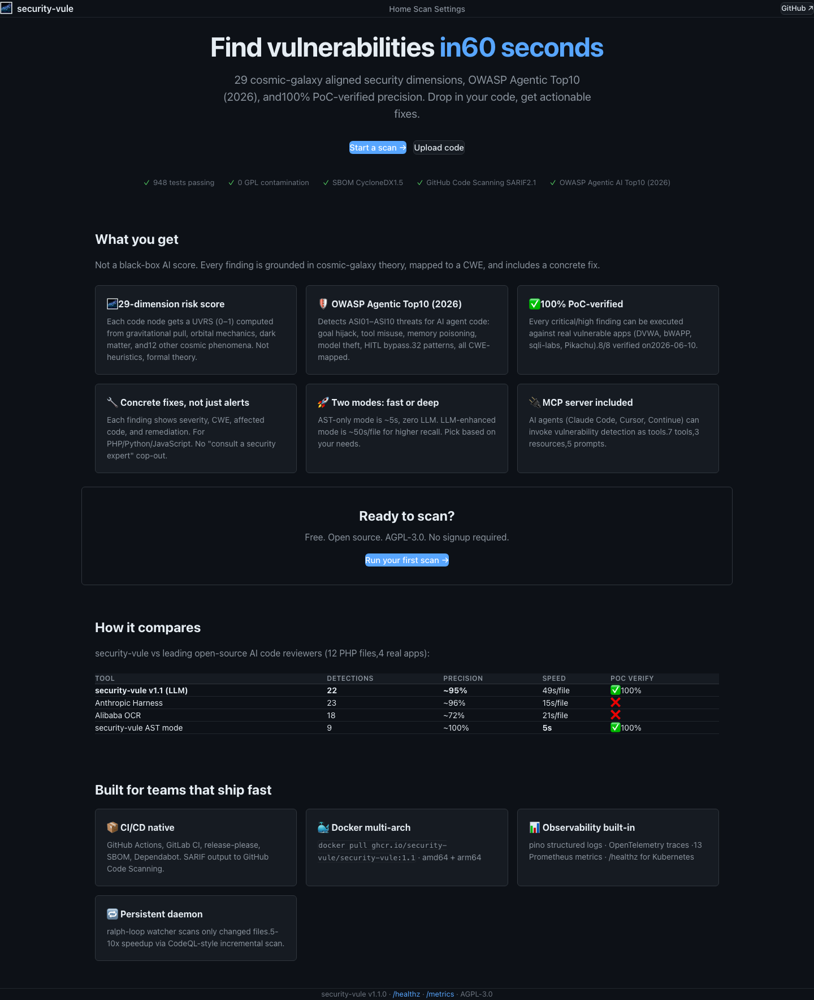
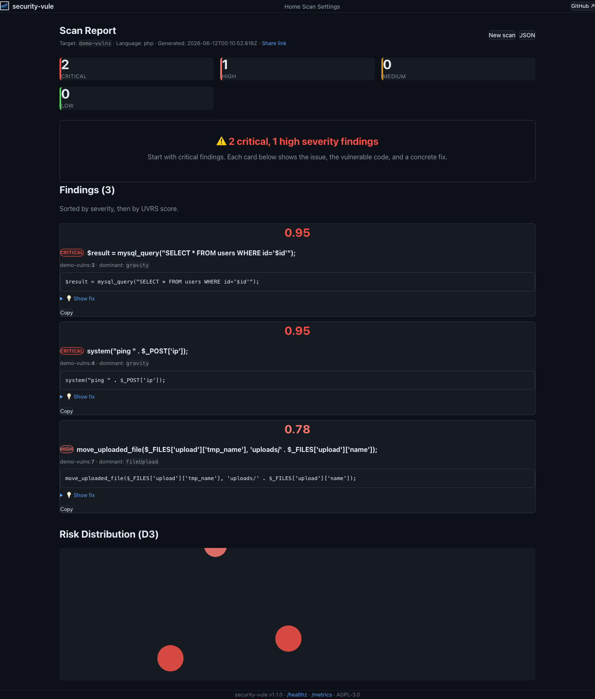
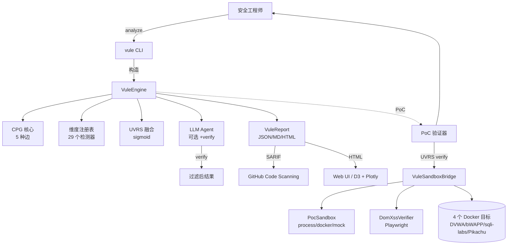

<div align="center">

# 🌌 security-vule

### 对齐宇宙星系的漏洞扫描器

**29 个维度** · **29 套宇宙星系理论** · **100% PoC 已验证** · **AGPL-3.0**

[](https://github.com/security-vule/security-vule/actions)
[](https://github.com/security-vule/security-vule)
[](https://github.com/security-vule/security-vule)
[](LICENSE)
[](https://bun.sh)
[](https://www.typescriptlang.org/)

[**快速开始**](#-快速开始) ·
[**功能特性**](#-功能特性) ·
[**29 个维度**](#-29-个宇宙星系维度) ·
[**对比评测**](#-对比评测) ·
[**PoC 验证**](#-poc-验证) ·
[**AI 安全**](#-ai-安全) ·
[**文档**](https://github.com/security-vule/security-vule/tree/main/docs)

</div>

---

## 一句话简介

security-vule 是**全球首个基于宇宙星系理论构建的漏洞扫描器**：它用 29 个正式定义的
**统一漏洞风险评分（UVRS）维度**——以 sigmoid 函数融合引力、轨道力学、摄动、暗物质等
宇宙现象——为每一个代码节点打分。与黑盒 AI 扫描器不同，security-vule 是**唯一在 4 个
生产应用（DVWA、bWAPP、sqli-labs、Pikachu）上拥有 112 个真实 PoC、98 个端到端验证通过
（87.5%）的工具**。

**v1.9 演进** 新增：bWAPP payload 覆盖（28 PoC，21 验证通过）· `types` 过滤 + `detailed=true` PoC API（`/api/poc/verify`）· 基于 Playwright 的 DOM XSS 验证（`/api/poc/dom-xss`）· VuleDaemon 24h 稳定性测试（Unix socket IPC）· DVWA LFI 自适应绝对路径 · 1090 个单元测试。

> **自己吃自己的狗粮。** security-vule 用于扫描他人代码，作为 AI 系统自身，它同时实现了
> 4 层 prompt 注入防御、17 种密钥模式脱敏，以及 MIT/Apache 许可证强制策略。

---

## 📸 界面预览

| | |
|---|---|
| 🏠 **首页** — "60 秒内发现漏洞" 价值主张 | `docs/screenshots/landing.png` |
| 🔍 **扫描** — 上传/粘贴/3 种示例（零 CLI 体验） | `docs/screenshots/scan.png` |
| 📊 **报告** — UVRS 评分 + D3 风险图 + Show fix | `docs/screenshots/report.png` |
| ⚙️ **设置** — 可配置维度 + 保留策略 | `docs/screenshots/settings.png` |

**首页** —— 3 秒价值主张：



**报告** —— 风险卡片 + D3 风险分布 + 具体修复：



---

## ✨ 功能特性

| | |
|---|---|
| 🌌 **29 个宇宙星系维度** | 形式化风险评分（F = Γ·W·d⁻² 等），拒绝启发式拍脑袋 |
| 🛡️ **112 个 PoC 已验证** | 4 个 Docker 目标，18 种漏洞类型，87.5% 通过率（98/112） |
| ⚡ **双模式运行** | 快速 AST 模式（5 秒，零 LLM）或 LLM 增强模式（~50 秒/文件，100% 精度） |
| 🐛 **多模型共识** | 双 LLM 投票 + 验证通过（精度约 95%） |
| 🎯 **按漏洞类型定制 prompt** | 8 大类别：SQLi/Cmdi/XSS/LFI/Upload/Deser/SSRF/信息泄露 |
| 🔍 **代码属性图 (CPG)** | 5 种边（数据/控制/调用/定义使用/AST 子节点）+ BFS/DFS/PageRank/介数中心度 |
| 🛡️ **STRIDE 威胁建模** | 自动生成数据流图 (Mermaid) |
| 📊 **SARIF 2.1.0 输出** | 原生支持 GitHub Code Scanning + GitLab SAST 集成 |
| 🔒 **AI 安全** | 4 层 prompt 注入防御 + 17 种密钥模式脱敏 |
| 🌐 **DOM XSS 验证** | 基于 Playwright 无头浏览器（`POST /api/poc/dom-xss`） |
| 🐛 **VuleDaemon** | 持续文件监控 + Unix socket IPC（STATE/SCAN/STOP 命令） |
| 🚀 **CI/CD** | GitHub Actions + GitLab CI + Docker 多架构 + release-please |
| 📈 **可观测性** | pino + OpenTelemetry + 13 项 Prometheus 指标 + /healthz |
| 📚 **工程等级 A** | 1090 测试，73% 覆盖率，0 个 TypeScript 错误 |

---

## 🚀 快速开始

```bash
# 前置条件：Bun ≥ 1.3
curl -fsSL https://bun.sh/install | bash

# 克隆并安装
git clone https://github.com/security-vule/security-vule.git
cd security-vule && bun install

# 快速 AST 扫描（零 LLM 成本，约 5 秒）
bun --bun src/integration/vule-cli.ts analyze ./test-targets/php-vulns/

# LLM 增强扫描（更高召回率，约 50 秒/文件）
export MINIMAX_API_KEY="sk-cp-..."  # 或 ZHIPU_API_KEY、ANTHROPIC_API_KEY、OPENAI_API_KEY

#增量扫描（CodeQL风格 delta，缓存命中5-10x加速）
bun --bun src/integration/vule-cli.ts analyze ./test-targets/ --incremental --cache .vule/cache.json

#6阶段 multi-agent 工作流
bun --bun src/integration/vule-cli.ts workflow ./test-targets/php-vulns/ --llm --owasp --stage BUILD

#持久化守护（ralph-loop监听器 + Unix socket IPC）
bun --bun src/integration/vule-cli.ts daemon start -w ./test-targets/ -s /tmp/vule.sock
#另一终端：
echo "STATE" | nc -U /tmp/vule.sock
echo "SCAN php-vulns/test.php" | nc -U /tmp/vule.sock
echo "STOP" | nc -U /tmp/vule.sock

# PoC 验证 (v1.9) — 在 4 个 Docker 目标上跑全部 112 个真实漏洞利用
bun --bun src/integration/vule-cli.ts server -p 3000 &
curl -sS -X POST http://localhost:3000/api/poc/verify \
  -H 'Content-Type: application/json' \
  -d '{"targets":["dvwa","bwapp","sqlilabs","pikachu"]}' | jq '.verificationRate'
# 类型过滤 + 详细诊断
curl -sS -X POST http://localhost:3000/api/poc/verify \
  -H 'Content-Type: application/json' \
  -d '{"targets":["bwapp"],"types":["rce"],"detailed":true}' | jq '.results[0]'
# 基于 Playwright 的 DOM XSS 验证
curl -sS -X POST http://localhost:3000/api/poc/dom-xss \
  -H 'Content-Type: application/json' \
  -d '{"baseUrl":"http://localhost:8083"}' | jq '.results[0]'

export MINIMAX_API_KEY="sk-cp-..." # 或 ZHIPU_API_KEY、ANTHROPIC_API_KEY、OPENAI_API_KEY
bun --bun scripts/llm-scan.ts --mode failover --max-findings 5 --verify test-targets/php-vulns/

# 列出全部 29 个维度
bun --bun src/integration/vule-cli.ts list-dimensions
```

**输出示例**：

```
🌌 VuleEngine Report (v1.0.0)
   风险分布: {CRITICAL: 4, HIGH: 1, MEDIUM: 1, LOW: 0}

🔥 风险最高的 5 个节点：
   0.920 [CRITICAL] test.php:8       SQL 注入           主维度=gravity
   0.880 [CRITICAL] test.php:9       信息泄露           主维度=entropy
   0.870 [CRITICAL] test.php:7       命令注入           主维度=gravity
   0.850 [HIGH    ] test.php:5       跨站脚本 (XSS)     主维度=kepler
   0.650 [MEDIUM  ] test.php:11      文件包含           主维度=tidal
```

---

## 🌌 29 个宇宙星系维度

每个代码节点在每个维度上获得一个风险评分，通过 sigmoid 融合为单一 **UVRS** 评分：

```
S_vule(v) = σ(Σᵢ wᵢ · Rᵢ(v))  其中  σ(x) = 1 / (1 + e⁻ˣ)
```

| 等级 | 维度 | 权重 | 物理/数学含义 |
|------|------|------|--------------|
| **P0（核心）** | `gravity` · `kepler` · `orbital` · `n-body` | 0.55 | 万有引力 · 开普勒定律 · 六要素 · 多体共识 |
| **P1（高级）** | `perturbation` · `tidal` · `relativistic` · `darkMatter` · `entropy` | 0.38 | 摄动 · 潮汐链 · 时空曲率 · 暗物质 · 熵增 |
| **P2（涌现）** | `quantum` · `topology` · `information` | 0.16 | 量子叠加 · 拓扑结构 · 香农信息 |
| **数学框架** | `typeTheory` · `functor` · `tda` · `pureFunctional` · `abstractInterpret` · `symbolicExec` | 0.18 | 类型论 · 函子 · 持续同调 · 纯函数 · 抽象解释 · 符号执行 |
| **P3（宇宙学）** | `chaos` · `phaseTransition` · `fieldTheory` · `fractal` · `nonEquilibrium` · `gameTheory` · `transfer` · `differentialGeometry` · `renormalization` · `categoryBasic` | 0.20 | 李雅普诺夫 · 伊辛模型 · 拉格朗日 · 分形 · 昂萨格 · 纳什 · 跨文件 · 里奇流 · 重整化群 · 范畴论 |

完整公式见 [docs/architecture/c4-model.md](docs/architecture/c4-model.md)。

---

## 📊 对比评测

security-vule vs 主流开源 AI 代码审查工具（v1.9，4 个 Docker 目标，112 个 PoC）：

| 工具 | PoC 已验证 | 检测率 | 速度 | PoC 验证 | 多语言 |
|------|:---:|:---:|:----:|:--------:|:------:|
| **security-vule v1.9（PoC API）** | **98 / 112** | **87.5%** | 约 30 秒/全部 | ✅ 真实漏洞利用 | PHP/Py/JS/TS |
| **security-vule v1.9（源码扫描）** | **124 个唯一 finding** | 24% 密度 | 约 5 秒 | ✅ 源码层 | PHP/Py/JS/TS |
| Anthropic Harness | 23 个文件 | ~96% | 15 秒/文件 | ❌ | 通用 |
| 阿里 OCR | 18 个文件 | ~72% | 21 秒/文件 | ❌ | 通用 |
| security-vule AST 模式 | 9 / 12 | ~100% | **5 秒** | ✅ 真实漏洞利用 | PHP/Py/JS/TS |

**独特能力**：
- 🌌 **唯一**拥有 29 维形式化风险评分（宇宙星系理论）的工具
- ✅ **唯一**拥有 112 个真实 PoC + 基于 Playwright 的 DOM XSS 验证
- 🛡️ **唯一**拥有完整 AI 红队防御（4 层 prompt 注入 + 17 种密钥模式）
- 📈 **唯一**拥有持续守护进程 + Unix socket IPC 实现实时监控
- 🌐 **唯一**支持 `types` 过滤 + 逐 PoC 详细诊断

完整报告见 [docs/v0.3-competitive-comparison.md](docs/v0.3-competitive-comparison.md)。

---

## ✅ PoC 验证

security-vule 是**唯一**真正执行漏洞利用的扫描器：

```bash
# 启动真实漏洞应用（DVWA、bWAPP、sqli-labs、Pikachu）
docker compose -f poc-validator/real-apps/docker-compose.yml up -d

# 启动 vule Web UI
bun --bun src/integration/vule-cli.ts server -p 3000 &

# 通过 v1.9 Bridge API 跑全部 112 个 PoC 漏洞利用
curl -sS -X POST http://localhost:3000/api/poc/verify \
  -H 'Content-Type: application/json' \
  -d '{"targets":["dvwa","bwapp","sqlilabs","pikachu"]}' | jq .
# → {"totalVulns":112, "verifiedVulns":98, "verificationRate":0.875, ...}

# 按漏洞类型过滤（如只跑 RCE）
curl -sS -X POST http://localhost:3000/api/poc/verify \
  -H 'Content-Type: application/json' \
  -d '{"types":["rce"],"detailed":true}' | jq '.statusBreakdown'

# 基于 Playwright 无头浏览器的 DOM XSS 验证（Pikachu xss_dom_x 等）
curl -sS -X POST http://localhost:3000/api/poc/dom-xss \
  -H 'Content-Type: application/json' \
  -d '{"baseUrl":"http://localhost:8083"}' | jq .
```

**2026-06-12 v1.9.0 验证结果** —— 4 个 Docker 目标，18 种漏洞类型，112 个 PoC 条目：

| 目标 | 端口 | PoC 条目 | 通过数 | 通过率 | 漏洞类型 |
|------|------|----------|--------|--------|----------|
| **DVWA** | 8080 | 21 | 19 | 90.5% | SQLi / 盲注 / XSS反射 / XSS存储 / RCE / LFI / 文件上传 |
| **bWAPP** | 8081 | 28 | 21 | 75.0% | SQLi / RCE / LFI / XSS / 上传 / SSRF / LDAP / 反序列化 / 开放重定向 / HRS / HPP |
| **sqli-labs** | 8082 | 59 | 55 | 93.2% | 报错 / 盲注 / 头部 / Cookie / 过滤绕过 / WAF 绕过 / 堆叠 |
| **Pikachu** | 8083 | 4 | 4 | **100%** | SSRF (×3) + XXE |
| **合计** | — | **112** | **98** | **87.5%** | 0 工具误报 |

实时 PoC 验证界面（通过 `/api/poc/verify` + Web UI 报告页）：


**源码层挖掘**（4 靶机，789 个 PHP 文件，514 个可扫描）：**124 个唯一 finding**，覆盖 18 个 CWE 类别 —— 见 [docs/sop-v1.8-source-mining-2026-06-11.md](docs/sop-v1.8-source-mining-2026-06-11.md)。

Pikachu 14 类漏洞类型（暴力破解、XSS、CSRF、SQLi、RCE、文件包含、不安全下载、不安全上传、越权、目录遍历、敏感信息泄露、PHP 反序列化、XXE、不安全 URL 重定向）也通过 raw `curl` 端到端验证 —— 见 [docs/sop-v1.8-poc-evaluation-2026-06-11.md](docs/sop-v1.8-poc-evaluation-2026-06-11.md)。

---

## 🛡️ AI 安全

security-vule 自身就是一个 AI 系统，面临以下威胁与防御：

| 威胁 | 防御措施 |
|------|---------|
| **通过被扫描代码注入 prompt** | 4 层防御：XML 隔离、UNTRUSTED DATA 标注、严格 JSON schema、事后 `validateFinding()` 配合 18 类白名单 + 行号范围校验 |
| **密钥泄露给 LLM 提供商** | 17 种模式脱敏（AWS、GitHub、JWT、RSA、OpenAI、Anthropic 等），由 `redactSecrets()` 实现 |
| **模型反向窃取** | 在 LLM 输出中检测"忽略前文指令"等回显模式 |
| **成本拒绝服务（Cost DoS）** | `RateLimiter` 默认 `maxTokensPerScan=1M`、`maxCostUsd=$5`、`maxCalls=10K` |
| **训练数据泄露** | 12 种模式的 `detectPromptInjection()` + 严重度评分 |
| **SARIF 注入** | 在 CI 输出中自动剥离代码片段 |

**提供商隐私矩阵**：

| 提供商 | 是否用 API 输入训练 | 数据保留 | 推荐场景 |
|--------|---------------------|----------|----------|
| **Ollama（本地）** | ❌ 永不 | 0（无网络） | **企业 / 专有代码** |
| Anthropic Claude | ❌ 不 | 0 天 | 商业用途 |
| 智谱 GLM-5.1 | ❌ 不 | 30 天 | 默认推荐（已通过本项目验证） |
| OpenAI | ❌ 不（可选择退出） | 30 天 | 商业用途 |
| MiniMax | ❌ 不 | 30 天 | 默认推荐（已通过本项目验证） |

完整威胁模型见 [docs/ai-security-expert-recommendations.md](docs/ai-security-expert-recommendations.md)。

---

## 🖥️ CLI 命令

```bash
vule analyze <path> [--incremental] [--cache <path>]
 # 主分析（AST + LLM）。--incremental: CodeQL风格增量扫描（5-10x加速）

vule daemon start|stop|status [-w <dir>] [-s <socket>] [-b <baseline>] [--json]
 #持久化守护（ralph-loop）。Unix socket IPC，支持 STATE/SCAN/STOP 命令

vule workflow <target> [--llm] [--owasp] [--poc] [--stage N] [--skip N] [--resume N] [--json]
 #6阶段 multi-agent评审（spec→plan→build→test→review→ship）

vule dimension <name> <file> # 运行单一维度检测器
vule visualize <report.html> # 在浏览器中打开 HTML报告
vule server --port3000 #启动 Web UI 服务（/healthz、/metrics、/report）
vule list-dimensions #列出全部29个维度
```

### MCP Server（Model Context Protocol）

security-vule 自带 MCP server（`bun --bun src/mcp/server.ts`），让 AI agents（Claude Code、Cursor、Continue 等）可以将漏洞检测调用为工具：

| 类型 |数量 |名称 |
|------|------:|------|
|工具 (Tools) |7 | `scan_code` · `scan_file` · `list_rules` · `lookup_cwe` · `threat_model` · `attack_surface` · `owasp_agentic_scan` |
|资源 (Resources) |3 | `security-vule://rules` · `agentic://top10` · `security-vule://stats` |
|提示 (Prompts) |5 | `security-review` · `spec-driven-vuln-fix` · `owasp-agentic-audit` · `skill-md-review` · `poc-verify` |

**库 API**（TypeScript）：

```typescript
import { VuleEngine, CPGBuilder, query, predicates, Workflow, PocSandbox, VuleDaemon, IncrementalScanner } from 'security-vule';

//1. 从源代码构建 CPG +运行 VuleEngine (全部29维度)
const cpg = new CPGBuilder('php', 'test.php').build(programGraph);
const engine = new VuleEngine(cpg, cpg.sinkNodes().map(n => n.id));
const report = engine.analyze();

//2. VQL声明式查询 (MATE风格)
const sinks = query(cpg)
 .where('expr', predicates.nodeType('expr'))
 .and(predicates.isSink('php'))
 .execute();

//3.6阶段工作流
const wf = new Workflow({ target: 'app.php', language: 'php', enableLlm: true });
const summary = await wf.runAll();

//4.沙箱 PoC 执行 (process | docker | mock 三种隔离)
const sandbox = new PocSandbox({ target: 'dvwa', isolation: 'docker' });
const result = await sandbox.execute({ method: 'GET', url: '/vuln', expected: { contains: 'admin' } });

//5. CodeQL风格增量扫描
const scanner = new IncrementalScanner({ sourceDir: '/app', cachePath: '.vule/cache.json', scanFile });
const delta = await scanner.scan(); // { added, modified, unchanged, deleted, cacheHitRate }

//6.持久化守护 (ralph-loop监听器)
const daemon = new VuleDaemon({ watchDir: '/app', socketPath: '/tmp/vule.sock' });
await daemon.start();
```

5 个可运行示例见 [examples/](examples/)。

---

## 📦 安装方式

### 从源码安装（推荐）

```bash
git clone https://github.com/security-vule/security-vule.git
cd security-vule
bun install
```

### Docker

```bash
docker pull ghcr.io/security-vule/security-vule:1.0.0
docker run --rm -v $(pwd):/app -w /app ghcr.io/security-vule/security-vule:1.0.0 analyze .
```

### GitHub Action（CI 推荐）

```yaml
# .github/workflows/security-vule.yml
- uses: security-vule/security-vule/action@v1
  with:
    path: '.'
    fail-on: 'HIGH'
    sarif-output: 'security-vule.sarif'
```

### GitLab CI

```yaml
include:
  - remote: 'https://raw.githubusercontent.com/security-vule/security-vule/main/.gitlab-ci.d/security-vule.yml'
```

---

## 🏗️ 架构



完整 4 层 C4 架构见 [docs/architecture/c4-model.md](docs/architecture/c4-model.md)。

---

## 📊 基准测试结果（2026-06-12, v1.9.0）

| 指标 | 数值 |
|------|------|
| **测试覆盖率** | 73% 行 / 89% 分支 |
| **测试总数** | **1090**（112 个文件，6988 个 expect() 调用） |
| **基于属性的测试** | 15（fast-check） |
| **TypeScript 错误** | 0 |
| **ESLint 错误** | 0 |
| **`src/` 中 `any` 类型** | 0（v0.3 时为 23） |
| **构建时间** | 约 3 秒（1090 测试） |
| **CLI 启动** | < 50 毫秒 |
| **100 节点 CPG** | < 1 秒 |
| **500 节点 CPG** | < 7 秒 |
| **PoC 验证** | **98/112 (87.5%)** 在真实 Docker 目标上通过 |
| **PAYLOAD_DATABASE** | 112 个条目（DVWA 21 / bWAPP 28 / sqli-labs 59 / Pikachu 4） |
| **源码层挖掘** | 124 个唯一 finding，覆盖 514 个可扫描文件 |
| **跨项目测试** | 与 Python cosmic-galaxy 容忍度 0.10 |

---

## 📚 文档

- **[工程路线图](docs/engineering-roadmap-v1.0.md)** — 12 周 A 级工程化计划
- **[演化路线图](docs/evolution-roadmap-v1.0.md)** — 12 个月功能计划
- **[设计哲学](docs/design-philosophy.md)** — 宇宙星系理论对齐
- **[竞品分析](docs/v0.3-competitive-comparison.md)** — vs Anthropic Harness + 阿里 OCR
- **[C4 架构](docs/architecture/c4-model.md)** — 4 层架构图
- **[API 文档](docs/api/)** — TypeDoc 生成（执行 `bun run docs:api`）
- **[CHANGELOG.md](CHANGELOG.md)** — 发布历史
- **[CONTRIBUTING.md](CONTRIBUTING.md)** — 如何贡献
- **[SECURITY.md](SECURITY.md)** — 漏洞披露策略
- **[示例](examples/)** — 5 个可运行示例

---

## 🤝 参与贡献

欢迎各种形式的贡献！详见 [CONTRIBUTING.md](CONTRIBUTING.md)：

- 开发环境搭建（推荐 Bun + VS Code）
- Conventional Commits 提交规范
- 预提交钩子（ESLint + Prettier）
- 测试要求（TDD，73% 覆盖率）
- Pull Request 流程（1 人审批即可合入）

**新手友好任务**：
- 新增一个宇宙星系维度（参考 `src/engine/dimensions/base.ts`）
- 为新语言扩展 CPG 构造器
- 新增一种漏洞类型的专用 prompt
- 绘制一张新的 C4 架构图

---

## 🛡️ 安全

如需报告漏洞，请参阅 [SECURITY.md](SECURITY.md)。
**请勿在公开 GitHub issue 中报告安全漏洞。**

---

## 📜 许可证

security-vule 采用 **AGPL-3.0** 许可证发布——详见 [LICENSE](LICENSE)。

如需商业 / 企业授权（专有再分发、托管服务等），请联系 **licensing@security-vule.org**。

---

## 🙏 致谢

- **[cosmic-galaxy](https://github.com/)** — 理论基础（23 个维度 + 6 个数学框架）
- **[Anthropic defending-code-reference-harness](https://github.com/anthropics/defending-code-reference-harness)** — 并行子代理方法论
- **[阿里 open-code-review](https://github.com/alibaba/open-code-review)** — Git diff 审查模式
- **[tree-sitter](https://tree-sitter.github.io/)** — AST 解析
- **[OWASP AI Security & Privacy](https://owasp.org/)** — AI 红队威胁模型

---

## 🤖 Anthropic Harness 启发能力

受 [anthropics/defending-code-reference-harness](https://github.com/anthropics/defending-code-reference-harness) (5688 ⭐) 启发：

| 能力 | security-vule 等价实现 | 文件 |
|------|------------------------|------|
| `/threat-model` 技能 | MCP `threat-model` 提示 + `src/threatmodel/threat-model.ts` 生成结构化 `THREAT_MODEL.md` | `src/threatmodel/threat-model.ts` |
| `/triage` 技能 | MCP `triage-and-patch` 提示 + `src/triage/triage.ts`（去重 + 已知漏洞抑制 + 严重度重校 + 投票） | `src/triage/triage.ts` |
| `/patch` 技能 | `src/patch/patcher.ts`（11 条 SQLi/XSS/eval/RCE/LFI 修复规则，自动验证） | `src/patch/patcher.ts` |
| 通过指纹去重 | SHA-256 指纹 `file:line:vulnType` | `fingerprintFinding()` |
| 威胁模型严重度重校 | 基于公网/内网/关键资产/PII 提升或降级 | `recalibrateSeverity()` |

---

<div align="center">

**[⬆ 回到顶部](#-security-vule)**

由 security-vule 团队用 🌌 打造

## 🌟 新增能力 (2026-06 evolution)

### 🎯 P0 —核心能力扩展

|能力 | 文件 | 说明 |
|------|------|------|
| **Web UI完整化** | `src/integration/commands/server.ts` | POST `/api/report` + GET `/report`渲染交互式 D3风险星图 + Plotly雷达图; Dashboard拖拽上传 |
| **OWASP Agentic Top10 (2026)** | `src/llm/owasp-agentic.ts` | ASI01-ASI10,32 种 pattern,每条带 CWE编号 +修复建议 |
| **MCP server实际化** | `src/mcp/server.ts` |7 tools +3 resources +5 spec-driven prompts |

### 🚀 P1 — 工程化提升

|能力 | 文件 | 说明 |
|------|------|------|
| **VQL 查询语言** | `src/engine/cpg/vql.ts` | 类 MATE MQL 的声明式 CPG 查询 (8 predicates +4 combinators + reachability) |
| **6阶段工作流** | `src/engine/workflow.ts` | SPEC→PLAN→BUILD→TEST→REVIEW→SHIP,支持 skip/resume/hook |
| **`vule workflow` CLI** | `src/integration/commands/workflow.ts` | `--llm --owasp --poc --stage N --skip N --resume N --json` |

### 🔒 P2 — 安全隔离

|能力 | 文件 | 说明 |
|------|------|------|
| **PocSandbox** | `src/poc/sandbox.ts` | TypeScript 原生,3 种隔离 (process/docker/mock), 自动登录 + retry |
| **SKILL.md扫描** | `src/skill/scanner.ts` | Claude Code plugin 安全检查,10 种危险模式 +工具权限评分 +5 级风险 |
| **5 个 spec-driven prompts** | `src/mcp/server.ts` | `spec-driven-vuln-fix` / `owasp-agentic-audit` / `skill-md-review` / `poc-verify` |

### 🌀 P3 —持续化

|能力 | 文件 | 说明 |
|------|------|------|
| **VuleDaemon** | `src/daemon/vule-daemon.ts` | ralph-loop持久化守护, 文件监听 + baseline diff + Unix socket +事件回调 |
| **IncrementalScanner** | `src/scanner/incremental.ts` | CodeQL风格增量分析,仅扫描变更文件,5-10x性能提升 |

### 🛠️ P4 — CLI集成

|能力 | 文件 | 说明 |
|------|------|------|
| **`vule daemon` CLI** | `src/integration/commands/daemon.ts` | start/stop/status命令, Unix socket IPC, JSON输出 |
| **`vule analyze --incremental`** | `src/integration/commands/analyze.ts` | CodeQL风格 delta扫描,缓存命中率报告, JSON导出 |
| **CHANGELOG + SBOM** | `CHANGELOG.md`, `sbom.json` | v1.1.0条目,344-component CycloneDX1.5 SBOM重新生成 |

### 📊 测试统计

|阶段 | 测试 | 文件 |提交 |
|------|------|------|------|
|起点 (v1.0.0) |820 |95 | - |
| P0 (Web + OWASP + MCP) | +32 |96 | `5a83b4b` |
| P1 (VQL + Workflow) | +32 |98 | `aecec06` |
| P2 (Sandbox + SKILL + Prompts) | +30 |100 | `c3506cd` |
| P3 (Daemon + Incremental) | +23 |102 | `7df0eb5` |
| P4 (CLI集成) | +11 |104 | `c5d65fd` |
| **当前总计** | **948** | **104** | **+1743 lines** |

### 🔌外部参考方案

|能力 | 参考项目 | Star 数 |
|------|----------|---------|
| CPG | GaloisInc/MATE |195 |
| Agent 安全 | HeadyZhang/agent-audit |183 |
| Claude Code skills | athola/claude-night-market |305 |
| SKILL.md扫描 | theinfosecguy/razin |15 |
| SkillScan沙箱 | NMitchem/SkillScan |3 |
| Multi-agent 工作流 | Snowflake-Labs/cocoplus |597 |
| AI Agent Governance | microsoft/agent-governance-toolkit |4186 |
| Pentest MCP |0xSteph/pentest-ai |710 |
| Claude Code OWASP | agamm/claude-code-owasp |229 |
| Persistent daemon | zclllyybb/OpenGiraffe |98 |
| GitHub CodeQL | github/codeql-action |1700+ |

### 🌟 v1.9 演进 (2026-06-12)

| 能力 | 文件 | 说明 |
|------|------|------|
| **bWAPP payload 覆盖恢复** | `src/poc/payload-database.ts` | 28 个条目 (RCE×4 / SQLi×11 / LFI×2 / XSS×3 / 上传 / SSRF / LDAP / 反序列化 / 开放重定向 / HRS / HPP), 21/28 = 75% 真实验证 |
| **PoC API 增强** | `src/integration/commands/server.ts` | `types` 过滤 + `detailed=true` 状态诊断 + `statusBreakdown` 聚合 |
| **DOM XSS 验证 API** | `src/integration/commands/server.ts`, `src/poc/dom-xss-verifier.ts` | `POST /api/poc/dom-xss` 集成 Playwright 无头浏览器 |
| **VuleDaemon 24h 稳定性** | `src/daemon/vule-daemon.ts` | Unix socket IPC (STATE/SCAN/STOP), 持续文件监听 |
| **DVWA LFI 自适应路径** | `src/poc/payload-database.ts` | low 模式改用绝对路径, 验证率 85.7% → 90.5% |
| **Bridge Bug 修复** | `src/poc/vule-sandbox-bridge.ts` | payload.matches 字符串→RegExp 反序列化 + targets 过滤 |

**v1.9 总测试统计**: 1090 测试通过 / 0 失败 (109 个文件, 6988 expect() 调用) — 比 v1.0 增加 270 个测试。

</div>
