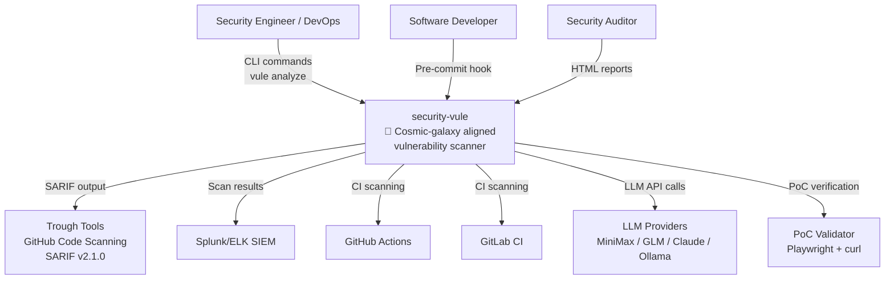
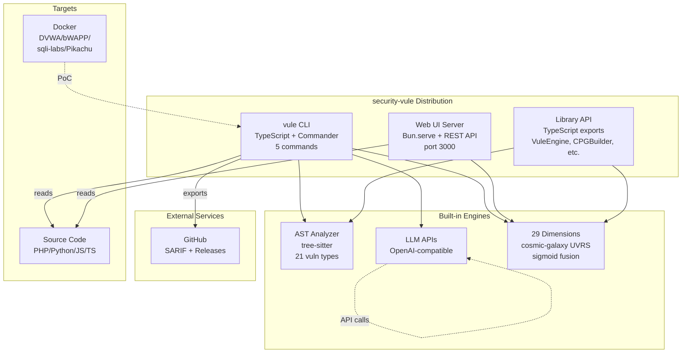
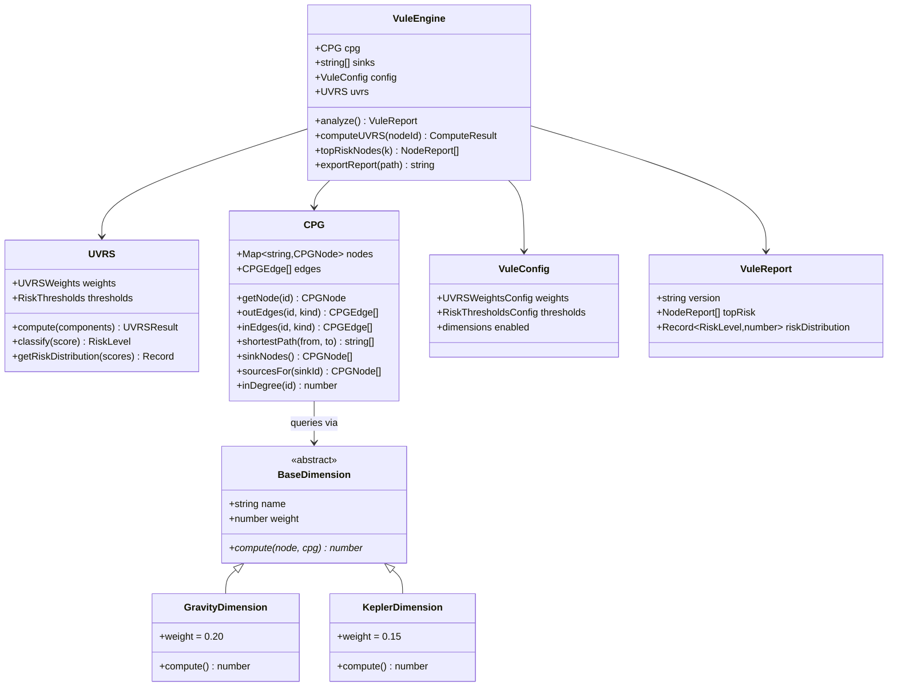
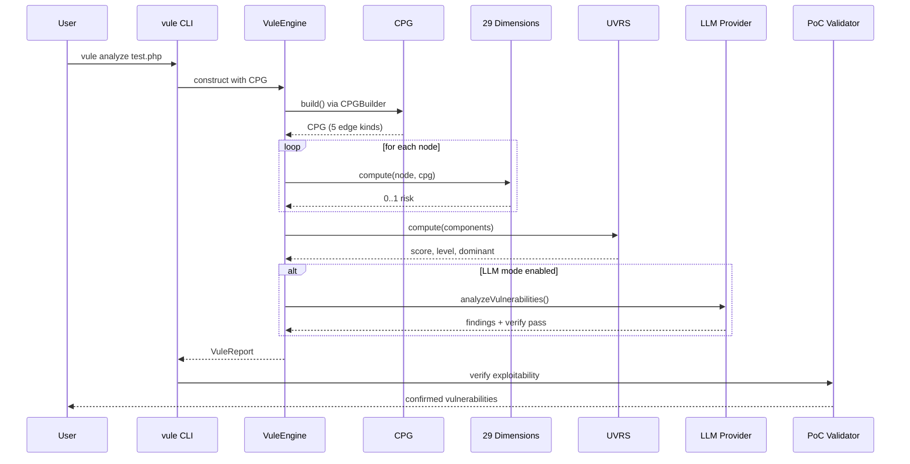
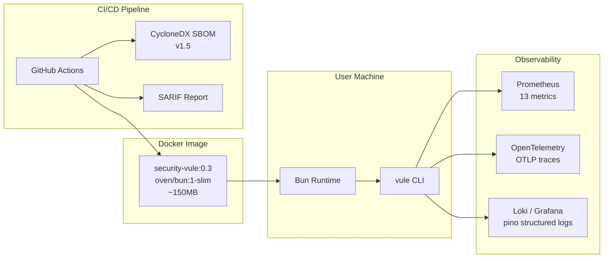
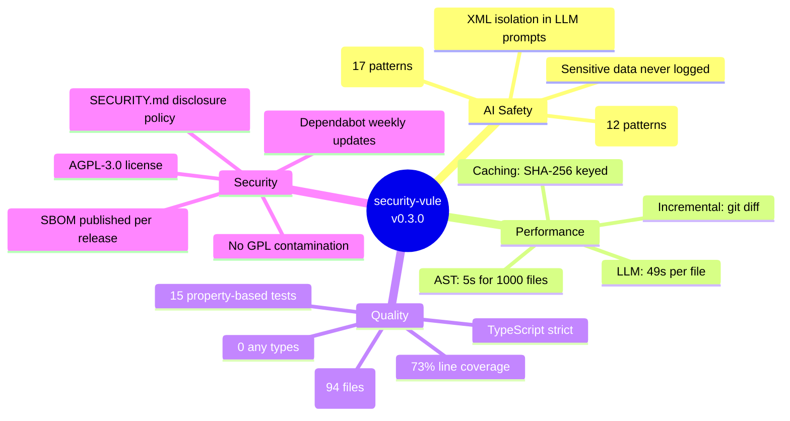

# security-vule Architecture (C4 Model)

> Auto-generated diagrams (mermaid) for security-vule v0.3.0.
> Last updated: 2026-06-10

This document uses the [C4 model](https://c4model.com/) to describe the security-vule architecture at four levels:
1. **Context** — how security-vule fits in the world
2. **Container** — major runnable units
3. **Component** — internal modules of the VuleEngine
4. **Code** — key classes and their relationships

---

## Level 1: System Context



**Key actors**:
- **Security Engineer**: Primary user, runs scans and reviews results
- **Software Developer**: Pre-commit hook integration
- **Security Auditor**: Reviews HTML reports and risk analysis
- **CI/CD Systems**: GitHub Actions, GitLab CI for automated scanning
- **External systems**: LLM providers, GitHub Code Scanning, SIEM, PoC validation

---

## Level 2: Container Diagram



**Key containers**:
- **vule CLI**: Main entry point, 5 commands (analyze, dimension, visualize, server, list-dimensions)
- **Web UI Server**: Long-running Bun.serve exposing /healthz, /metrics, HTML dashboard
- **Library API**: TypeScript exports for programmatic integration
- **29 Dimension Detectors**: Cosmic-galaxy-aligned risk scoring
- **AST Analyzer**: tree-sitter-based fast static analysis (5s)
- **LLM Agent**: Slow but high-recall semantic analysis with verify pass

---

## Level 3: Component Diagram (VuleEngine)

```mermaid
graph TB
    subgraph "Entry Layer"
        CLI[vule CLI<br/>commander]
        Server[Web UI Server]
    end

    subgraph "VuleEngine"
        Engine[VuleEngine<br/>analyze/topRisk<br/>exportReport]
        Config[VuleConfig<br/>YAML loader]
        Report[VuleReport<br/>JSON/MD exporters]
    end

    subgraph "UVRS"
        UVRS[UVRS Engine<br/>sigmoid fusion]
        RiskLevel[RiskLevel<br/>enum]
    end

    subgraph "Dimension Registry"
        Registry[Registry<br/>getEnabledDimensions<br/>normalizeWeights]
        Base[BaseDimension<br/>abstract]
        P0[4 P0<br/>gravity/kepler/<br/>orbital/nbody]
        P1[5 P1<br/>perturbation/tidal/<br/>relativistic/darkMatter/entropy]
        P2[3 P2<br/>quantum/topology/<br/>information]
        P3[10 P3<br/>chaos/phaseTransition/...]
        MF[6 math frameworks<br/>typeTheory/functor/<br/>tda/pureFunctional/<br/>abstractInterpret/symbolicExec]
    end

    subgraph "CPG Core"
        CPG[CPG<br/>5 edge kinds]
        Types[types.ts<br/>interfaces]
        Builder[CPGBuilder<br/>from ProgramGraph]
        Queries[queries.ts<br/>bfs/dfs/allPaths/<br/>downstream/upstream]
        Metrics[metrics.ts<br/>pagerank/betweenness/<br/>degreeStats]
        Sinks[sinks.ts<br/>dangerous functions]
    end

    subgraph "LLM Pipeline"
        Agent[LLMAgent<br/>specialized prompts]
        Verify[verifyFindings<br/>AI FP filter]
        Router[LLM Router<br/>8 providers]
    end

    CLI --> Engine
    Server --> Engine
    Engine --> Config
    Engine --> Registry
    Engine --> UVRS
    Engine --> Report
    Engine --> CPG

    Registry --> Base
    Base --> P0
    Base --> P1
    Base --> P2
    Base --> P3
    Base --> MF

    Registry --> CPG
    P0 --> CPG
    P1 --> CPG
    P2 --> CPG
    P3 --> CPG
    MF --> CPG

    CPG --> Types
    CPG --> Builder
    CPG --> Queries
    CPG --> Metrics
    CPG --> Sinks

    Engine -.->|optional| Agent
    Agent --> Verify
    Agent --> Router
```

**Key components**:
- **VuleEngine** is the single entry point that orchestrates CPG + dimensions + UVRS
- **Registry** is the dimension catalog (29 detectors)
- **CPG core** is the data substrate (5 edge kinds, 5 query methods, 3 metrics)
- **LLM pipeline** is optional, used for higher recall

---

## Level 4: Code Diagram (Key Classes)



**Key relationships**:
- VuleEngine composes CPG + UVRS + VuleConfig
- All dimensions extend BaseDimension (abstract)
- CPG provides query API used by all dimensions
- VuleReport is the output of VuleEngine.analyze()

---

## Data Flow: Scan → PoC



**Key data flow**:
1. CLI parses target file → constructs CPG
2. For each CPG node, all 29 dimensions compute their risk contribution
3. UVRS fuses the contributions via sigmoid
4. Optional LLM pass adds semantic analysis with verify filter
5. VuleReport is generated
6. Optional PoC validation confirms exploitability

---

## Deployment View



**Deployment options**:
- **CLI**: Direct Bun invocation on user machine
- **Docker**: Multi-arch (amd64+arm64) image, ~150MB
- **CI/CD**: GitHub Actions runs docker, exports SARIF + SBOM
- **Observability**: Prometheus scrapes /metrics, Tempo collects OTLP traces, Loki ingests pino logs

---

## Cross-cutting Concerns



**Cross-cutting concerns** that span all components:
- **AI Safety**: Every LLM call is wrapped in safety checks
- **Performance**: Caching, incremental, async pipeline
- **Quality**: Strict TypeScript, property-based tests, lint clean
- **Security**: SBOM, license check, secret scanning, Dependabot

---

## See Also

- [docs/design-philosophy.md](../design-philosophy.md) — cosmic-galaxy design philosophy
- [docs/engineering-roadmap-v1.0.md](../engineering-roadmap-v1.0.md) — 12-week engineering plan
- [docs/evolution-roadmap-v1.0.md](../evolution-roadmap-v1.0.md) — 12-month feature plan
- [docs/v0.3-competitive-comparison.md](../v0.3-competitive-comparison.md) — competitive analysis
- [C4 model](https://c4model.com/) — Simon Brown's architecture framework
