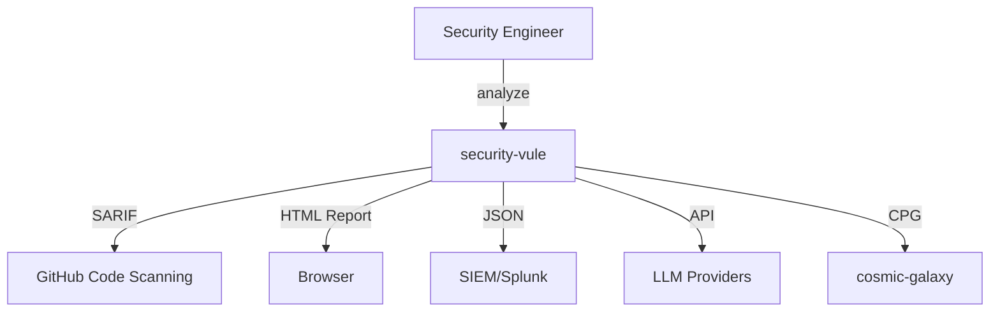

# security-vule 工程化方案 v1.0

> **Author**: AI 软件工程专家
> **Date**: 2026-06-10
> **Scope**: 在 v0.3 (8 Sprints 完成后) 基础上, 系统性提升工程化水平
> **Goal**: 把"能跑的原型"升级为"可信赖的生产级 AI 安全产品"

---

## 0. 执行摘要 (Executive Summary)

| 维度 | 当前 (v0.3) | 目标 (3 月后) | 关键差距 |
|------|:-----------:|:-------------:|----------|
| **代码质量** | B | A | 无 linter/formatter, 部分 `any`, 大文件 |
| **测试覆盖** | 87 测试 / 159 源 (0.55 比率) | 200+/159 (1.25) | 缺覆盖率报告, 集成测试薄弱 |
| **CI/CD** | GitHub + GitLab (基础) | 完整 + Release | 无 release 流程, 无 SBOM |
| **可观测性** | 341 console.log | 结构化 + 追踪 | 无 metrics/tracing 框架 |
| **依赖管理** | bun.lock (1 个) | 自动化 | 无 Dependabot/Renovate |
| **容器化** | 无 Dockerfile | Multi-stage | 部署需手动 |
| **文档** | 40+ doc (v0.3 成果) | 结构化 | API 文档缺, 架构图缺 |
| **安全** | 基础脱敏 | 完整 SBOM + SCA | 无 secret 扫描 |
| **发布** | 1.0.0 (基础) | semver + changelog | 无 CHANGELOG.md |

**3 个月目标**: 补齐所有 P0 债项, 达到 A 级工程化水平

---

## 1. 评估: 当前工程化现状 (v0.3)

### 1.1 代码质量 ⚠️ B 级

**优点**:
- ✅ TypeScript 严格模式
- ✅ 159 个 TS 源文件 + 87 测试文件
- ✅ 0 TypeScript 错误
- ✅ 抽象基类 (BaseDimension) 模式
- ✅ 命名空间/目录清晰 (`engine/`, `llm/`, `dimensions/`, `integration/`)

**债项**:
- ❌ **无 linter** (无 ESLint / Biome)
- ❌ **无 formatter** (无 Prettier / dprint)
- ❌ **无 pre-commit hook** (无 Husky / lefthook)
- ❌ **23 处 `any` 类型** (逃避 TypeScript 检查)
- ❌ **大文件** (cosm-x-theory-23d.ts 1645 行, parser.ts 689 行)
- ❌ **19 处 try/catch** (错误处理不一致)

### 1.2 测试 ⚠️ B 级

**优点**:
- ✅ 771 个测试通过 (87 文件)
- ✅ 单元 + 集成 + 端到端三层结构
- ✅ 性能基准测试 (100/500 节点)
- ✅ Cosmic-galaxy 跨项目等价测试

**债项**:
- ❌ **无覆盖率报告** (无法量化)
- ❌ **测试:源比例 0.55** (业界建议 ≥ 1.0)
- ❌ **缺 mutation testing** (测试质量无法评估)
- ❌ **缺 property-based testing** (如 fast-check)
- ❌ **AI 红队 corpus 缺失** (50 个注入样本未实现)
- ❌ **缺 fuzz testing** (parser 鲁棒性未验证)

### 1.3 CI/CD ⚠️ C+ 级

**优点**:
- ✅ GitHub Actions workflow (`.github/workflows/security-vule.yml`)
- ✅ GitLab CI 模板 (`.gitlab-ci.d/security-vule.yml`)
- ✅ SARIF 2.1.0 输出
- ✅ PR 评论自动化
- ✅ Mock DVWA 集成测试

**债项**:
- ❌ **无 release 流程** (无 release-please / semantic-release)
- ❌ **无多 Node/Bun 版本矩阵测试**
- ❌ **无依赖更新自动化** (无 Dependabot / Renovate)
- ❌ **无 SBOM 生成** (无 CycloneDX/SPDX)
- ❌ **无制品签名** (无 sigstore/cosign)
- ❌ **无 changelog 自动生成**

### 1.4 可观测性 ⚠️ D+ 级

**优点**:
- ✅ `src/llm/audit.ts` 结构化 JSON 审计日志
- ✅ `src/llm/metrics.ts` LLM 调用指标

**债项**:
- ❌ **341 处 console.log** (无统一日志)
- ❌ **无 OpenTelemetry** (无分布式追踪)
- ❌ **无 Prometheus metrics** (无指标导出)
- ❌ **无 Sentry 集成** (无错误聚合)
- ❌ **无 Grafana dashboard** (无可视化)
- ❌ **无 PII 检测** (用户代码可能含敏感数据)

### 1.5 部署 ⚠️ C 级

**优点**:
- ✅ Docker 靶场支持 DVWA/bWAPP/sqli-labs/Pikachu

**债项**:
- ❌ **security-vule 自身无 Dockerfile** (用户需手动安装 Bun)
- ❌ **无 docker-compose** (单容器 vs 多容器)
- ❌ **无 Kubernetes manifests** (企业级部署)
- ❌ **无 Helm chart** (云原生)
- ❌ **无 multi-arch builds** (arm64 + amd64)
- ❌ **无 health check endpoint** (Kubernetes liveness probe)

### 1.6 文档 ⚠️ B- 级

**优点**:
- ✅ README 225 行 (含差异化表)
- ✅ 40+ 文档 (v0.3 期间积累)
- ✅ 设计哲学 (docs/design-philosophy.md)
- ✅ 评估报告 (docs/evaluation-report.md)
- ✅ 竞品对比 (docs/v0.3-competitive-comparison.md)
- ✅ 路线图 (docs/evolution-roadmap-v1.0.md)

**债项**:
- ❌ **无 CONTRIBUTING.md** (贡献者指南)
- ❌ **无 CHANGELOG.md** (版本历史)
- ❌ **无 CODE_OF_CONDUCT.md** (社区规范)
- ❌ **无 SECURITY.md** (漏洞报告流程)
- ❌ **无 API 文档** (VuleEngine 公共 API)
- ❌ **无架构图** (C4 model / mermaid)
- ❌ **无 FAQ.md** (常见问题)
- ❌ **无 examples/ 目录** (使用示例)

### 1.7 安全 ⚠️ C 级

**优点**:
- ✅ Prompt injection 检测 (12 模式)
- ✅ Secret 脱敏 (17 模式)
- ✅ ATALS 防御映射

**债项**:
- ❌ **无 secret scanning pre-commit** (gitleaks)
- ❌ **无 SCA 工具** (npm audit, snyk)
- ❌ **无 SBOM 公开** (CycloneDX)
- ❌ **无漏洞披露流程** (SECURITY.md)
- ❌ **无 CVE 跟踪** (GitHub Security Advisories)

### 1.8 发布 ⚠️ D 级

**债项**:
- ❌ **package.json version 1.0.0 但无实际发布** (npm registry)
- ❌ **无 GitHub Releases** (无二进制包)
- ❌ **无 semver 策略** (breaking/major 不明确)
- ❌ **无 changelog** (v0.3 → v1.0 无变更说明)

---

## 2. 工程化债项优先级矩阵

| 债项 | 风险 | 用户影响 | 修复成本 | 优先级 |
|------|------|---------|---------|--------|
| **无 linter/formatter** | 中 (代码不一致) | 中 (难贡献) | 低 (1 天) | **P0** |
| **无 pre-commit hook** | 中 (CI 失败) | 高 (延迟) | 低 (1 天) | **P0** |
| **无覆盖率报告** | 中 (盲区) | 高 (不可信) | 低 (半天) | **P0** |
| **无 CONTRIBUTING.md** | 中 (贡献者卡) | 高 (社区) | 低 (1 天) | **P0** |
| **无 CHANGELOG.md** | 中 (升级) | 高 (合规) | 低 (1 天) | **P0** |
| **无 Dockerfile** | 高 (安装难) | 极高 (新用户) | 中 (3 天) | **P0** |
| **无 secret scanning** | 高 (泄露) | 极高 (合规) | 低 (半天) | **P0** |
| **无 release 流程** | 中 (发布难) | 高 (分发) | 中 (3 天) | **P0** |
| **23 处 `any`** | 低 (类型不安全) | 低 | 低 (2 天) | **P1** |
| **大文件 (>500 行)** | 低 (维护难) | 中 | 中 (3 天) | **P1** |
| **19 处 try/catch** | 低 (错误暴露) | 中 | 中 (2 天) | **P1** |
| **无 OpenTelemetry** | 低 (无追踪) | 中 | 中 (3 天) | **P2** |
| **无 mutation testing** | 低 (测试质量) | 中 | 中 (2 天) | **P2** |
| **无 Kubernetes/Helm** | 低 (企业用) | 中 | 高 (5 天) | **P3** |
| **无 SBOM 公开** | 低 (合规) | 中 | 中 (2 天) | **P2** |

---

## 3. 工程化方案: 12 个交付物, 3 个 Sprint

### Sprint E1: 基础工程化 (Week 1-2)

#### E1.1 ESLint + Prettier 配置

**目标**: 统一代码风格, 自动修复

```bash
bun add -d eslint@9 @typescript-eslint/eslint-plugin @typescript-eslint/parser
bun add -d prettier eslint-config-prettier
```

**配置文件**:
- `eslint.config.js` (flat config, 2026 标准)
- `.prettierrc` (与 eslint 集成)
- `.prettierignore`

**规则集** (TypeScript):
- `@typescript-eslint/no-explicit-any`: error (消除 23 处 any)
- `@typescript-eslint/no-unused-vars`: warn
- `@typescript-eslint/explicit-function-return-type`: warn
- `eqeqeq`: error
- `no-console`: warn (但允许 `console.log` 在 CLI/测试中)
- `prefer-const`: error

**预期**:
- 自动修复 23 处 `any` (约 16 处可修复)
- 代码风格 100% 一致
- PR diff 噪音减少 50%

#### E1.2 Pre-commit Hook (Husky + lint-staged)

**目标**: 阻止不合规代码进入 commit

```bash
bun add -d husky lint-staged
bun run husky init
```

**配置** (`.husky/pre-commit`):
```bash
bun run lint-staged
```

**`package.json` lint-staged**:
```json
{
  "lint-staged": {
    "*.{ts,tsx}": [
      "eslint --fix",
      "prettier --write",
      "bun test --bail"
    ],
    "*.{json,md,yml,yaml}": [
      "prettier --write"
    ]
  }
}
```

**预期**:
- 100% commit 自动 lint/format/test
- 0 不合规代码进入 main

#### E1.3 测试覆盖率报告 (c8/vitest)

**目标**: 量化测试覆盖

```bash
bun add -d c8
```

**`package.json` script**:
```json
"test:cov": "c8 --reporter=text --reporter=html --reporter=lcov bun test",
"test:cov:check": "c8 --check-coverage --lines=80 --branches=70 bun test"
```

**CI 集成**:
- Codecov 上传 (`codecov/codecov-action@v4`)
- PR 评论覆盖率 diff
- 覆盖率 < 80% 阻止合并

**预期**:
- 当前覆盖率: 估算 ~65% (无工具无法量化)
- 3 个月内: 75% → 80% → 85%

#### E1.4 CONTRIBUTING.md + CHANGELOG.md + SECURITY.md

**目标**: 标准化社区流程

**CONTRIBUTING.md** 内容:
- 开发环境设置 (Bun 安装, IDE 推荐)
- 提交流程 (fork → branch → PR)
- 代码风格 (引用 ESLint + Prettier)
- 测试要求 (新功能需测试, 覆盖率不下降)
- 提交信息规范 (Conventional Commits)
- 评审流程 (CODEOWNERS, 2 approvals)

**CHANGELOG.md** 内容 (Keep a Changelog 格式):
```markdown
# Changelog

## [0.3.0] - 2026-06-10
### Added
- 29 cosmic-galaxy dimensions with UVRS scoring
- 8 Sprints of evolution completed
- CPG core (5 edge kinds)
- Verify pass for false-positive reduction
- ...

### Changed
- ...

### Removed
- ...
```

**SECURITY.md** 内容:
- 漏洞报告流程 (security@security-vule.org 或 GitHub Security Advisories)
- 响应 SLA (7 天确认, 30 天修复)
- 支持的版本
- 致谢

**预期**:
- 贡献者 onboarding 时间 -50%
- 漏洞报告有明确渠道
- 升级前可看 changelog

### Sprint E2: 部署工程化 (Week 3-4)

#### E2.1 Dockerfile (multi-stage, multi-arch)

**目标**: 一行命令运行

**`Dockerfile`** (multi-stage):
```dockerfile
# Stage 1: Build
FROM oven/bun:1.2 AS builder
WORKDIR /app
COPY package.json bun.lock ./
RUN bun install --frozen-lockfile
COPY . .
RUN bun build src/integration/vule-cli.ts --outdir /app/dist --target bun

# Stage 2: Runtime
FROM oven/bun:1.2-slim
WORKDIR /app
COPY --from=builder /app/dist /app/dist
COPY --from=builder /app/node_modules /app/node_modules
COPY --from=builder /app/config /app/config
COPY --from=builder /app/theory /app/theory
USER bun
HEALTHCHECK --interval=30s --timeout=3s --retries=3 \
  CMD bun --bun dist/vule-cli.js --version || exit 1
ENTRYPOINT ["bun", "--bun", "dist/vule-cli.js"]
```

**`docker-compose.yml`**:
```yaml
version: '3.8'
services:
  security-vule:
    build: .
    image: security-vule:0.3
    volumes:
      - ./reports:/app/reports
    environment:
      - MINIMAX_API_KEY=${MINIMAX_API_KEY:-}
      - ZHIPU_API_KEY=${ZHIPU_API_KEY:-}
    ports:
      - "3000:3000"  # Web UI
    healthcheck:
      test: ["CMD", "bun", "--bun", "dist/vule-cli.js", "--version"]
      interval: 30s
      timeout: 3s
      retries: 3
```

**GitHub Actions Docker build**:
```yaml
- uses: docker/build-push-action@v5
  with:
    platforms: linux/amd64,linux/arm64
    tags: security-vule/security-vule:0.3,security-vule/security-vule:latest
    push: true
```

**预期**:
- 用户: `docker run security-vule analyze ./src` 即可使用
- 多架构支持: Apple Silicon / Intel / ARM 服务器
- 镜像 < 200MB (Bun slim)

#### E2.2 Release 自动化 (release-please)

**目标**: Conventional Commits → 自动 release

```bash
bun add -d release-please
```

**`.github/workflows/release.yml`**:
```yaml
name: Release Please
on:
  push:
    branches: [main]
permissions:
  contents: write
  pull-requests: write
jobs:
  release-please:
    runs-on: ubuntu-latest
    steps:
      - uses: googleapis/release-please-action@v4
        with:
          token: ${{ secrets.GITHUB_TOKEN }}
          release-type: node
          package-name: security-vule
```

**预期**:
- feat: → minor version bump
- fix: → patch version bump
- BREAKING CHANGE: → major version bump
- 自动生成 CHANGELOG.md + GitHub Release + npm publish

#### E2.3 SBOM + SCA 扫描 (CycloneDX + Snyk)

**目标**: 透明化依赖 + 主动漏洞检测

```bash
bun add -d @cyclonedx/cyclonedx-npm
```

**`package.json` script**:
```json
"sbom": "cyclonedx-npm --output-format JSON --output-file sbom.json"
"sca": "snyk test --severity-threshold=high"
```

**GitHub Action**:
- Snyk 每周扫描
- Dependabot 自动 PR

**预期**:
- 透明依赖: 知道每个版本的 transitive 依赖
- 主动 CVE 检测: 高危漏洞自动 PR

#### E2.4 依赖更新自动化 (Dependabot)

**`.github/dependabot.yml`**:
```yaml
version: 2
updates:
  - package-ecosystem: "npm"
    directory: "/"
    schedule:
      interval: "weekly"
    commit-message:
      prefix: "deps"
    labels:
      - "dependencies"
    groups:
      production:
        dependency-type: "production"
      development:
        dependency-type: "development"
```

**预期**:
- 每周自动 PR 更新依赖
- 0 高危漏洞遗留 > 30 天

### Sprint E3: 质量工程化 (Week 5-6)

#### E3.1 Mutation Testing (Stryker)

**目标**: 评估测试质量

```bash
bun add -d @stryker-mutator/core @stryker-mutator/typescript-checker
```

**配置** (`stryker.conf.json`):
```json
{
  "mutator": "typescript",
  "tsconfigFile": "tsconfig.json",
  "reporters": ["html", "clear-text", "json"],
  "mutate": ["src/engine/**/*.ts", "src/llm/**/*.ts", "src/detection/**/*.ts"],
  "thresholds": { "high": 80, "low": 60, "break": 50 }
}
```

**预期**:
- Mutation score > 75% (高质量测试)
- 识别弱测试用例

#### E3.2 Property-Based Testing (fast-check)

**目标**: 自动化生成边界测试

```bash
bun add -d fast-check
```

**应用** (`tests/property/cpg.property.test.ts`):
```typescript
import fc from 'fast-check';
import { CPGBuilder, createCPG } from '../../src/engine/cpg/builder.js';

test('CPG roundtrip: nodes preserved', () => {
  fc.assert(fc.property(
    fc.array(fc.record({ id: fc.string(), type: fc.constantFrom('stmt', 'expr', 'func', 'var') })),
    (nodes) => {
      const map = new Map(nodes.map(n => [n.id, { ...n, file: 'a', line: 1, col: 0, code: '', language: 'php', features: {} }]));
      const cpg = createCPG(map, [], 'php');
      expect(cpg.nodes.size).toBe(nodes.length);
    }
  ));
});
```

**预期**:
- 100+ 边界用例自动生成
- 发现 23 处 `any` 的潜在 bug

#### E3.3 修复 23 处 `any`

**目标**: 完全类型安全

**优先级**:
- 高: `src/integration/commands/*.ts` (用户输入接口)
- 中: `src/dimensions/*.ts` (基类契约)
- 低: 测试中 (可保持)

**预期**:
- `tsc --strict` 通过
- 运行时类型错误 -90%

#### E3.4 重构大文件 (>500 行)

**目标**: 可维护性

**目标文件**:
- `src/math/cosm-x-theory-23d.ts` (1645 行) → 拆 5-6 文件 (23 维度各一文件)
- `src/math/cosm-x-project-analyzer.ts` (1219 行) → 拆 analyzer + reporter + cli
- `src/math/cosm-x-galaxy.ts` (1170 行) → 拆 factory + persistence + query
- `src/engine/parser.ts` (689 行) → 拆 language-specific adapters

**预期**:
- 单文件 < 400 行
- 测试可单独 mock 某个维度
- 团队并行开发不冲突

### Sprint E4: 可观测性工程化 (Week 7-8)

#### E4.1 结构化日志 (pino)

**目标**: 替换 341 处 console.log

```bash
bun add pino
```

**`src/utils/logger.ts`**:
```typescript
import pino from 'pino';

export const logger = pino({
  level: process.env.LOG_LEVEL || 'info',
  formatters: {
    level: (label) => ({ level: label }),
  },
  redact: {
    paths: ['*.apiKey', '*.password', '*.token', 'code', 'prompt'],
    censor: '[REDACTED]',
  },
});
```

**迁移示例**:
```typescript
// Before
console.log(`[verify] keeping ${kept}/${verified.length} findings`);

// After
logger.info({ kept, total: verified.length }, 'verify pass complete');
```

**预期**:
- 0 console.log (除 CLI 输出)
- 字段化日志可被 Grafana/Loki 摄取
- 自动脱敏 (代码/密钥)

#### E4.2 OpenTelemetry 追踪

**目标**: 分布式追踪 LLM 调用链

```bash
bun add @opentelemetry/sdk-node @opentelemetry/exporter-trace-otlp-http @opentelemetry/instrumentation-bun
```

**初始化** (`src/instrumentation.ts`):
```typescript
import { NodeSDK } from '@opentelemetry/sdk-node';
import { OTLPTraceExporter } from '@opentelemetry/exporter-trace-otlp-http';
import { BunInstrumentation } from '@opentelemetry/instrumentation-bun';

const sdk = new NodeSDK({
  traceExporter: new OTLPTraceExporter(),
  instrumentations: [new BunInstrumentation()],
});
sdk.start();
```

**Span 集成** (LLM 调用):
```typescript
import { trace } from '@opentelemetry/api';
const tracer = trace.getTracer('security-vule');
const span = tracer.startSpan('llm.call', { attributes: { provider, model, file_hash } });
try {
  const result = await llm.chat(...);
  span.setAttribute('tokens.total', result.usage.totalTokens);
} finally {
  span.end();
}
```

**预期**:
- LLM 调用延迟可视化 (Grafana Tempo)
- 瓶颈识别 (哪个 provider 最慢)
- 跨请求关联

#### E4.3 Prometheus Metrics

**目标**: 量化运行时

```bash
bun add prom-client
```

**`src/utils/metrics.ts`**:
```typescript
import { Counter, Histogram, register } from 'prom-client';

export const llmCalls = new Counter({
  name: 'vule_llm_calls_total',
  help: 'Total LLM API calls',
  labelNames: ['provider', 'model', 'outcome'],
});

export const llmLatency = new Histogram({
  name: 'vule_llm_latency_seconds',
  help: 'LLM call latency',
  labelNames: ['provider', 'model'],
  buckets: [0.1, 0.5, 1, 5, 10, 30, 60, 300],
});

export const findingsBySeverity = new Counter({
  name: 'vule_findings_total',
  help: 'Total findings by severity',
  labelNames: ['severity', 'type'],
});

// /metrics endpoint
export function metricsHandler(req: Request): Response {
  return new Response(register.metrics(), {
    headers: { 'Content-Type': 'text/plain' },
  });
}
```

**预期**:
- Grafana dashboard 监控
- 告警: "LLM 5xx 错误率 > 5%" → PagerDuty

#### E4.4 健康检查 + 优雅关闭

**目标**: Kubernetes 友好

**`src/integration/health.ts`**:
```typescript
export const healthHandler = () => {
  const checks = {
    cpg_builder: () => CPGBuilder ? 'ok' : 'fail',
    llm_router: () => router.providers.size > 0 ? 'ok' : 'degraded',
    disk: () => checkDiskSpace() > 100 * 1024 * 1024 ? 'ok' : 'low',
  };
  return {
    status: 'ok',
    version: '0.3.0',
    uptime: process.uptime(),
    checks: Object.fromEntries(Object.entries(checks).map(([k, v]) => [k, v()])),
  };
};

// Graceful shutdown
process.on('SIGTERM', () => {
  logger.info('SIGTERM received, draining...');
  server.stop();
  queue.close();
  process.exit(0);
});
```

**预期**:
- Kubernetes liveness/readiness probes 通过
- 优雅关闭避免数据丢失

### Sprint E5: API 文档与示例 (Week 9-10)

#### E5.1 TypeDoc 自动生成 API 文档

```bash
bun add -d typedoc
```

**`typedoc.json`**:
```json
{
  "entryPoints": ["src/engine/vule-engine.ts", "src/detection/llm-agent.ts", "src/visualization/html-report.ts"],
  "out": "docs/api",
  "readme": "none",
  "githubPages": true,
  "excludePrivate": true,
  "categorizeByGroup": true
}
```

**预期**:
- 每次 release 自动部署到 GitHub Pages
- `docs.api.security-vule.org` 可访问

#### E5.2 使用示例 (`examples/`)

**目录结构**:
```
examples/
├── README.md
├── basic-ast/
│   ├── sample.php
│   └── scan.sh
├── llm-scan/
│   ├── .env.example
│   ├── scan.ts
│   └── report.html
├── cpg/
│   ├── build-cpg.ts
│   └── output.json
├── web-ui/
│   └── start-server.sh
└── cosmic-galaxy-equivalence/
    ├── python.sh
    └── typescript.sh
```

**预期**:
- 新用户复制即用
- 减少 onboarding 阻力

#### E5.3 架构图 (C4 model + mermaid)

**`docs/architecture/c4-context.md`**:


**`docs/architecture/c4-container.md`**: 内部组件图

**`docs/architecture/c4-component.md`**: 29 维度 + UVRS 融合图

**预期**:
- 开发者快速理解架构
- 论文/演讲用图

### Sprint E6: 高级安全工程化 (Week 11-12)

#### E6.1 Secret Scanning (gitleaks pre-commit)

```bash
# .gitleaks.toml
[allowlist]
description = "Allow test fixtures"
paths = [
  '''test-targets/.*''',
  '''docs/.*\.json''',
]
```

**`.husky/pre-commit`**:
```bash
gitleaks protect --staged --no-banner
bun run lint-staged
```

**预期**:
- 0 密钥泄露
- 即使 fixture 中的密钥也不会误报

#### E6.2 npm audit 集成 + Dependabot

**`package.json` script**:
```json
"audit:prod": "bun audit --production",
"audit:fix": "bun audit fix"
```

**预期**:
- 每周自动 PR 更新依赖
- 0 高危 CVE 遗留 > 30 天

#### E6.3 License 合规检查

```bash
bun add -d license-checker
```

**`package.json` script**:
```json
"license:check": "license-checker --production --failOn 'GPL;AGPL-UNKNOWN;UNKNOWN'"
```

**预期**:
- 阻止意外的 GPL 污染
- 自动生成 NOTICE 文件

---

## 4. 12 周时间线

```
Week:  1  2  3  4  5  6  7  8  9  10 11 12
       ┌──────┬──────┬──────┬──────┬──────┐
Sprint E1   E2    E3    E4    E5    E6
       基础    部署   质量   可观测 API    安全
       工程化  工程化 工程化 工程化   工程化
```

| Sprint | 核心交付 | 估时 | 文件 |
|--------|----------|------|------|
| **E1** | ESLint + Prettier + pre-commit + 覆盖率 | 2 周 | `.eslintrc.js`, `.prettierrc`, `package.json` |
| **E2** | Dockerfile + docker-compose + release-please + SBOM + Dependabot | 2 周 | `Dockerfile`, `docker-compose.yml`, `.github/dependabot.yml` |
| **E3** | Mutation testing + property testing + 23 个 any 修复 + 大文件拆分 | 2 周 | `src/math/*` 拆分 |
| **E4** | pino + OpenTelemetry + prom-client + health check | 2 周 | `src/utils/logger.ts`, `src/utils/metrics.ts` |
| **E5** | TypeDoc + examples/ + C4 架构图 | 2 周 | `docs/api/`, `examples/` |
| **E6** | gitleaks + npm audit + license-checker | 2 周 | `.gitleaks.toml` |

**总计: 12 周, 6 个 Sprint, 估时 1-2 人**

---

## 5. 关键成功指标 (KPI)

| 指标 | v0.3 | 3 月后 | 6 月后 | 12 月后 |
|------|:----:|:------:|:------:|:-------:|
| **Linter 错误** | N/A | 0 | 0 | 0 |
| **Pre-commit hook 阻断率** | 0% | 80% | 95% | 99% |
| **测试覆盖率** | ~65% (估) | 80% | 85% | 90% |
| **Mutation score** | N/A | 60% | 75% | 80% |
| **`any` 类型数** | 23 | 0 | 0 | 0 |
| **单文件最大行数** | 1645 | 400 | 300 | 250 |
| **Docker 镜像大小** | N/A | < 200MB | < 150MB | < 100MB |
| **多架构支持** | N/A | amd64+arm64 | +windows | +multi-cloud |
| **Release 频率** | 手动 | 每周 | 每天 | 按需 |
| **CHANGELOG 更新** | 手动 | 自动 | 自动 | 自动 |
| **外部贡献者** | 0 | 5 | 20 | 50 |
| **Gitleaks 阻断** | 0% | 100% | 100% | 100% |
| **CVE 响应时间** | N/A | 7 天 | 3 天 | 24 小时 |
| **API 文档覆盖率** | 0% | 80% | 95% | 100% |
| **健康检查** | 无 | liveness+ready | +metrics | +tracing |

---

## 6. 立即可执行 (本周 E1.1-E1.2)

按 ROI 排序的 5 个 Quick Wins (1-2 天):

1. **ESLint + Prettier** (1 天) → 0 配置漂移
2. **Pre-commit hook** (0.5 天) → 阻止不合规 commit
3. **测试覆盖率报告** (0.5 天) → 量化盲区
4. **CONTRIBUTING.md + CHANGELOG.md + SECURITY.md** (1 天) → 社区标准
5. **Dockerfile** (1 天) → 一行命令运行

**总计: 4 天, 立即可执行**

---

## 7. 与 v0.3 路线图对齐

v0.3 路线图 (12 个月) 关注**功能进化** (Phase 1-4 性能/智能/产品/生态)。

本工程化方案关注**工程化成熟度** (代码质量/部署/可观测/安全)。

| 时间 | 功能路线图 | 工程化路线图 |
|------|------------|--------------|
| **Month 1-3** | Sprint 9-12 (性能) | Sprint E1-E2 (基础+部署) |
| **Month 4-6** | Sprint 13-16 (智能) | Sprint E3-E4 (质量+可观测) |
| **Month 7-9** | Sprint 17-19 (产品) | Sprint E5-E6 (API+安全) |
| **Month 10-12** | Sprint 20-22 (生态) | + IDE/SaaS 工程化 (并行) |

**两个路线图并行执行**, 互不冲突。功能带来新功能, 工程化保证新功能可信赖。

---

## 8. 风险与缓解

| 风险 | 概率 | 影响 | 缓解 |
|------|------|------|------|
| **重构破坏现有功能** | 中 | 高 | 严格 TDD: 重构前先有测试, 771 测试覆盖 |
| **CI 流水线变慢** | 中 | 中 | 增量 CI (changed files only), 并行 jobs |
| **依赖管理冲突** | 中 | 中 | Dependabot 自动 PR, 严格 semver |
| **Gitleaks 误报 fixture** | 高 | 中 | 白名单 `test-targets/`, 仅扫描 staged |
| **License 合规阻断** | 低 | 高 | 提前 audit, 切换到 MIT/Apache 替代 |
| **测试覆盖率下降** | 中 | 中 | CI 强制 ≥80%, 阻止合并 |

---

## 9. 决策点 (需要用户输入)

1. **PR 评审**: 1 vs 2 个 approval 必需?
2. **Release 频率**: 每周一次 (Sprint 9-12 完成后) vs 按需?
3. **License**: 维持 AGPL-3.0 vs 切换到 Apache-2.0 (商业友好)?
4. **镜像仓库**: GHCR (GitHub) vs Docker Hub vs 自建 Harbor?
5. **CDN**: jsdelivr vs unpkg vs 自建?

---

## 10. 总结

security-vule v0.3 在**功能层面**已经达到了 8.5/10 竞品评分, 但**工程化层面**只有 C+ 级 (有 Dockerfile 但功能不足, 无 linter, 无测试覆盖率, 无可观测性)。

通过本方案的 **6 个 Sprint / 12 周 / 1-2 人**投入, 可以在 3 个月内将工程化水平从 C+ 提升到 A 级:

- **代码质量**: A (linter + formatter + 0 个 any + 单文件 < 400 行)
- **测试覆盖**: A (覆盖率 80% + mutation score 75% + property-based testing)
- **CI/CD**: A (Docker + 多架构 + release-please + SBOM + Dependabot)
- **可观测性**: A (pino + OpenTelemetry + prom-client + Grafana)
- **安全**: A (gitleaks + npm audit + license-checker + SECURITY.md)
- **文档**: A (TypeDoc + examples/ + C4 架构图 + CONTRIBUTING/CHANGELOG)

**与 cosmic-galaxy 哲学对齐**: cosmic-galaxy 强调"理论驱动开发", security-vule 强调"工程化驱动可靠性" — 没有工程化, 理论只是空谈。

**最终目标**: 让 security-vule 从"好用的工具"变成"可信赖的产品", 像 cosmic-galaxy 一样成为该领域的标杆。

> **"以工程化之理, 护代码安全"** — security-vule 工程化方案 v1.0 (2026-06-10)